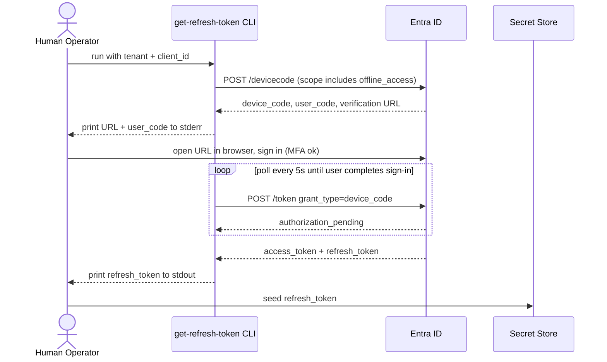
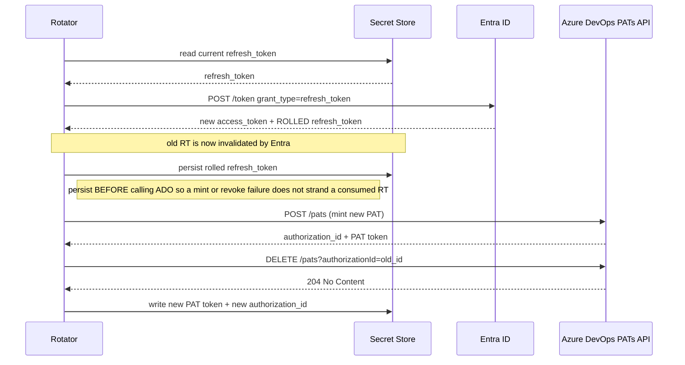

# Runbook: Azure DevOps PAT Rotation via Entra Refresh Token

> **Rotator:** `pat` (Azure DevOps) in this repo. See the [main README](../README.md#pat-azure-devops) for where this runbook fits.
> **Scope:** Azure AD (Entra ID) app registration, OAuth 2.0 refresh-token bootstrap, and Akeyless Rotated Secret wiring. Covers everything needed to make Azure DevOps PAT rotation work end to end.
> **Status:** Verified in production against the custom-producer rotator.
> **Estimated time:** ~15 minutes for initial bootstrap; ~2 minutes to re-bootstrap after RT expiry.
> **Prerequisites:** Global Administrator (or Application Administrator + Cloud Application Administrator) on the Entra tenant; Azure DevOps organization membership for the user who will own the rotated PATs; `az` CLI signed in to the right tenant; Go 1.21+ for the one-time device-code helper.

---

## What this runbook solves

You have an automation system (a rotator, a CI job, a KeyVault populated at build time) that needs to **programmatically create and revoke Azure DevOps Personal Access Tokens**. The obvious design (service principal → token → PAT API) does not work and never will, because Microsoft has explicitly blocked it.

> Microsoft Learn, "Manage PATs with REST API":
> *"Service principals or managed identities can't create or manage PATs. Only delegated user tokens are supported."*

This constraint holds even if you use workload identity federation, client credentials, or any other non-delegated flow. The Azure DevOps PATs API (`https://vssps.dev.azure.com/{org}/_apis/tokens/pats`) validates that the bearer token was issued via a flow that represents a **real user**. If it wasn't, the API returns an HTML sign-in page with HTTP 203 or 401, never a useful error.

The only supported automation path is:

1. A human signs in once via **OAuth 2.0 device-code flow** with the `offline_access` scope.
2. Entra issues a **refresh token** (RT), valid for up to 90 days of active use.
3. The automation exchanges the RT for a short-lived access token (AT) every time it needs to mint/revoke a PAT.
4. **Every exchange rolls the RT.** The response contains a new RT that must be persisted, replacing the old one.

This runbook covers steps 1–4 in isolation, so the output (a working tenant_id + client_id + refresh_token triple) can be consumed by any downstream system.

---

## Failure mode you are avoiding

The alternative is pasting a 1-hour Azure CLI access token (`az account get-access-token --resource 499b84ac-1321-427f-aa17-267ca6975798`) directly into the automation as a `bearer_token`. It "works" for the first rotation cycle. 60 minutes later the token expires, the PATs API starts returning an HTML sign-in page, and **rotation silently fails until a human notices**. The ADO error response is literally the HTML of the sign-in form. No JSON, no clean 401, so downstream error handling often misclassifies it as a 500.

If you see PAT rotation failing with an error body starting with `<!DOCTYPE html` and containing `Azure DevOps Services | Sign In`, that is the symptom of expired-bearer-token auth. The fix is this runbook.

---

## Architecture

### Bootstrap flow (runs once)



### Rotation flow (runs every cycle)



### Components

| Component | Role | Where it lives |
|---|---|---|
| **Entra app registration** | Public-client OAuth app with delegated `user_impersonation` on Azure DevOps. One per automation chain. | Your Entra tenant |
| **Delegated user** | The human whose identity signs in during bootstrap. All PATs created by the automation are owned by this user. | Your Entra tenant |
| **Refresh token** | Long-lived delegated credential (up to 90 days of active use). Rolled on each exchange. | Your secret store |
| **`get-refresh-token` helper** | One-shot Go CLI that runs device-code flow and prints an RT. Source below. | Repo + your laptop |
| **Automation / rotator** | Whatever consumes the RT to mint PATs. Out of scope for this runbook; see separate rotator runbook. | Wherever your rotation logic runs |

### Key constants for every tenant

| Constant | Value | What it is |
|---|---|---|
| **Azure DevOps resource ID** | `499b84ac-1321-427f-aa17-267ca6975798` | Microsoft's public well-known app ID for Azure DevOps. Use this as the `resource` / `scope` when requesting tokens targeting ADO. Hardcoded globally by Microsoft, not tenant-specific. |
| **Delegated scope** | `user_impersonation` | The only delegated scope the ADO resource exposes. Covers PAT minting. There is no separate `vso.pats` delegated scope; that name refers to a PAT scope string (what PATs grant), not an Entra permission. |
| **Azure AD token endpoint** | `https://login.microsoftonline.com/{tenant}/oauth2/v2.0/token` | Where RT exchanges happen. |
| **Device code endpoint** | `https://login.microsoftonline.com/{tenant}/oauth2/v2.0/devicecode` | Where bootstrap starts. |
| **PATs API base** | `https://vssps.dev.azure.com/{org}/_apis/tokens/pats?api-version=7.1-preview.1` | CRUD endpoint for PATs. |

---

## Prerequisites

- You know the **Entra tenant ID** (the one whose users own the target Azure DevOps organization).
- You know the **ADO organization name** (the `{org}` segment in `https://dev.azure.com/{org}`).
- You have picked a **delegated user**: the identity that will sign in during bootstrap. All rotated PATs will be owned by this user in ADO. It does not need to be the same user who registers the app; it does need to be a member of the ADO organization with PAT-creation permission.
- `go` 1.21+ installed on the machine that will run `get-refresh-token`.

---

## Roles and responsibilities

This runbook involves up to **three different people**. If you are handing off steps, this table tells you whom to ask.

| Role | Who / what permissions | Steps they perform |
|---|---|---|
| **A. Entra tenant admin** | Global Administrator, **or** Application Administrator + Cloud Application Administrator on the tenant. Can register apps and grant admin consent for delegated Microsoft Graph / Azure DevOps scopes. | 1a, 1b, 1c, 1d, 1e; Decommission steps 1–3 |
| **B. Delegated user** | Regular Entra user with membership in the target Azure DevOps organization and permission to create PATs (any org member by default, unless your org disabled "Allow users to create full-scoped PATs"). May be the same person as Role A or a different person. MFA is fine. | 2c (interactive browser sign-in only) |
| **C. Automation operator / Akeyless admin** | Whoever owns the Akeyless account and the rotator deployment. Needs: admin access in Akeyless (to create/update Web Targets and Rotated Secrets), write access to the rotator's Kubernetes namespace (or wherever the rotator runs), ability to run a Go program. Needs no Azure permissions. | 2a, 2b, 2d, 2e, Step 4, Verification, ongoing operations |

If Role A is not you: skip directly to [Step 1: Register the Entra app](#step-1-register-the-entra-app), copy the commands for steps 1a to 1e verbatim into a ticket or DM to your tenant admin, ask them to run the commands and return `APP_ID` and the tenant ID. Resume from Step 2.

If Role B is not you: skip to [Step 2: Bootstrap the refresh token via device code](#step-2-bootstrap-the-refresh-token-via-device-code), run steps 2a and 2b yourself, then send the stderr output (URL and user code) to the delegated user with the instructions from step 2c. They sign in in their browser; you capture the output.

### Quick permission check (Role A)

If you are unsure whether you have the Entra admin role required:

```bash
az login --tenant <tenant-id>
az rest --method GET --uri "https://graph.microsoft.com/v1.0/me/memberOf" \
  --query "value[?'@odata.type'=='#microsoft.graph.directoryRole'].displayName" -o tsv
```

A line reading `Global Administrator`, `Application Administrator`, or `Cloud Application Administrator` means you can do steps 1a–1e. An empty result means you cannot. Find someone who can.

### Verify `az` context (Role A)

```bash
az account show --query '{user:user.name, tenantId:tenantId, subscriptionId:id}' -o json
```

Confirm `tenantId` matches the tenant you intend to use. If not: `az login --tenant <tenant-id>`.

---

## Step 1: Register the Entra app

> **👤 Performed by: Role A (Entra tenant admin)**
> **Required permissions:** Global Administrator, **or** Application Administrator + Cloud Application Administrator
> **If this isn't you:** copy the commands in 1a–1e verbatim and send them to your tenant admin. They run them, send you back the `APP_ID` (appears in 1b's output) and the tenant ID (from the `az account show` check above). Then you resume from Step 2.

This creates a single-tenant public-client app with the one delegated permission required: Azure DevOps `user_impersonation`. All commands use `az` CLI; they are equivalent to portal click-through and easier to version-control.

### 1a. Look up the scope ID *(Role A)*

The `user_impersonation` scope has a deterministic ID on the Azure DevOps service principal. Query it rather than hardcoding (protects against the unlikely event that Microsoft re-publishes with a new ID):

```bash
ADO_RESOURCE_ID=499b84ac-1321-427f-aa17-267ca6975798

USER_IMPERSONATION_SCOPE_ID=$(az ad sp show \
  --id "$ADO_RESOURCE_ID" \
  --query "oauth2PermissionScopes[?value=='user_impersonation'].id" \
  -o tsv)

echo "$USER_IMPERSONATION_SCOPE_ID"
# expected: ee69721e-6c3a-468f-a9ec-302d16a4c599
```

### 1b. Create the app *(Role A)*

```bash
APP=$(az ad app create \
  --display-name "pat-rotator" \
  --sign-in-audience AzureADMyOrg \
  --is-fallback-public-client true \
  --required-resource-accesses "[{
    \"resourceAppId\": \"$ADO_RESOURCE_ID\",
    \"resourceAccess\": [
      {\"id\": \"$USER_IMPERSONATION_SCOPE_ID\", \"type\": \"Scope\"}
    ]
  }]" \
  --query '{appId:appId, objectId:id}' -o json)

echo "$APP"
# => {"appId": "xxxxxxxx-...", "objectId": "yyyyyyyy-..."}

APP_ID=$(echo "$APP" | python3 -c "import json,sys;print(json.load(sys.stdin)['appId'])")
```

Key flags explained:
- `--sign-in-audience AzureADMyOrg`: single-tenant. Use `AzureADMultipleOrgs` only if you need the same app to work against other customers' ADO orgs (rare and harder to secure).
- `--is-fallback-public-client true`: enables "Allow public client flows" in the portal. **Required for device-code flow.** Without this, bootstrap fails with `AADSTS7000218: The request body must contain the following parameter: 'client_assertion' or 'client_secret'`.
- `--required-resource-accesses`: requests the delegated `user_impersonation` scope on ADO. Requesting is not the same as granting; see 1d.

### 1c. Create the service principal *(Role A)*

Admin consent cannot be granted against an app that has no service principal in the tenant yet. Create one:

```bash
az ad sp create --id "$APP_ID" --query '{spObjectId:id}' -o json
```

### 1d. Grant admin consent *(Role A)*

```bash
az ad app permission grant \
  --id "$APP_ID" \
  --api "$ADO_RESOURCE_ID" \
  --scope user_impersonation \
  --query '{scope:scope, consentType:consentType}' -o json
# expected: {"scope": "user_impersonation", "consentType": "AllPrincipals"}
```

`consentType: AllPrincipals` means every user in the tenant is pre-consented to the app; they will not see a consent prompt during device-code sign-in. This is the standard choice for an automation app.

> **Why not just `az ad app permission admin-consent`?** In some CLI versions that command returns success without actually persisting the grant. `az ad app permission grant` is more reliable and the result is immediately visible via `az ad app permission list-grants`.

### 1e. Verify the registration *(Role A, or Role C with read access)*

```bash
az ad app show --id "$APP_ID" --query '{
  displayName:displayName,
  appId:appId,
  publicClient:isFallbackPublicClient,
  permissions:requiredResourceAccess
}' -o json
```

Expected shape:
```json
{
  "displayName": "pat-rotator",
  "appId": "<client-id>",
  "publicClient": true,
  "permissions": [{
    "resourceAppId": "499b84ac-1321-427f-aa17-267ca6975798",
    "resourceAccess": [{"id": "ee69721e-6c3a-468f-a9ec-302d16a4c599", "type": "Scope"}]
  }]
}
```

**Record these values.** You need them for steps 2, 3, and for seeding the downstream automation:

```
TENANT_ID  = <az account show --query tenantId>
CLIENT_ID  = <appId from above>
ADO_ORG    = <your Azure DevOps org name>
```

---

## Step 2: Bootstrap the refresh token via device code

> **👤 Performed by: Role C (automation operator) + Role B (delegated user)**
> **Required permissions:**
> - Role C needs only local shell access and Go installed. No Azure permissions.
> - Role B needs to be an active Entra user in the same tenant and a member of the target Azure DevOps organization with PAT-creation rights. MFA is fine.
> **If Role B isn't you:** after running 2b, send the URL and user code (from `/tmp/rt.err`) to the delegated user with the instructions from 2c. You continue with 2d as soon as they complete sign-in.

This is the one interactive step. The `get-refresh-token` helper does two HTTP requests to Entra (device-code request, then polling for token) and prints an RT to stdout. Everything else (URL, user code, sign-in) is handled by the delegated user in a browser.

### 2a. The helper source *(Role C)*

The helper lives in the repo at [`go/rotator/bin/get-refresh-token/main.go`](../go/rotator/bin/get-refresh-token/main.go). Source is reproduced below so you can run it without cloning the repo if you prefer.

Save as `get-refresh-token.go`:

```go
// get-refresh-token performs OAuth 2.0 device-code flow against Entra ID and
// prints a refresh token to stdout. Intended for one-time bootstrap.
package main

import (
	"bytes"
	"context"
	"encoding/json"
	"flag"
	"fmt"
	"io"
	"net/http"
	"net/url"
	"os"
	"time"
)

const (
	deviceCodeURL = "https://login.microsoftonline.com/%s/oauth2/v2.0/devicecode"
	tokenURL      = "https://login.microsoftonline.com/%s/oauth2/v2.0/token"
	defaultScope  = "499b84ac-1321-427f-aa17-267ca6975798/.default offline_access"
)

func main() {
	tenant := flag.String("tenant", "", "Entra tenant ID (required)")
	clientID := flag.String("client-id", "", "app registration client ID (required)")
	scope := flag.String("scope", defaultScope, "OAuth scope")
	flag.Parse()

	if *tenant == "" || *clientID == "" {
		fmt.Fprintln(os.Stderr, "usage: get-refresh-token --tenant <id> --client-id <id> [--scope <s>]")
		os.Exit(2)
	}

	ctx := context.Background()
	dc, err := requestDeviceCode(ctx, *tenant, *clientID, *scope)
	if err != nil {
		fmt.Fprintf(os.Stderr, "device code request failed: %v\n", err)
		os.Exit(1)
	}
	fmt.Fprintln(os.Stderr, dc.Message)

	tok, err := pollForToken(ctx, *tenant, *clientID, dc)
	if err != nil {
		fmt.Fprintf(os.Stderr, "token poll failed: %v\n", err)
		os.Exit(1)
	}
	if tok.RefreshToken == "" {
		fmt.Fprintln(os.Stderr, "no refresh_token in response (did you include offline_access in scope?)")
		os.Exit(1)
	}
	fmt.Fprintf(os.Stderr, "got refresh_token (scope=%q, access_token expires in %ds)\n", tok.Scope, tok.ExpiresIn)
	fmt.Println(tok.RefreshToken)
}

type deviceCodeResp struct {
	DeviceCode      string `json:"device_code"`
	UserCode        string `json:"user_code"`
	VerificationURI string `json:"verification_uri"`
	ExpiresIn       int    `json:"expires_in"`
	Interval        int    `json:"interval"`
	Message         string `json:"message"`
}

type tokenResp struct {
	AccessToken      string `json:"access_token"`
	RefreshToken     string `json:"refresh_token"`
	ExpiresIn        int    `json:"expires_in"`
	Scope            string `json:"scope"`
	Error            string `json:"error"`
	ErrorDescription string `json:"error_description"`
}

func requestDeviceCode(ctx context.Context, tenant, clientID, scope string) (*deviceCodeResp, error) {
	data := url.Values{"client_id": {clientID}, "scope": {scope}}
	req, err := http.NewRequestWithContext(ctx, http.MethodPost, fmt.Sprintf(deviceCodeURL, tenant), bytes.NewBufferString(data.Encode()))
	if err != nil {
		return nil, err
	}
	req.Header.Set("Content-Type", "application/x-www-form-urlencoded")
	resp, err := http.DefaultClient.Do(req)
	if err != nil {
		return nil, err
	}
	defer func() { _ = resp.Body.Close() }()
	body, _ := io.ReadAll(resp.Body)
	if resp.StatusCode != http.StatusOK {
		return nil, fmt.Errorf("HTTP %d: %s", resp.StatusCode, string(body))
	}
	var dc deviceCodeResp
	if err := json.Unmarshal(body, &dc); err != nil {
		return nil, fmt.Errorf("parse: %w", err)
	}
	if dc.Interval <= 0 {
		dc.Interval = 5
	}
	return &dc, nil
}

func pollForToken(ctx context.Context, tenant, clientID string, dc *deviceCodeResp) (*tokenResp, error) {
	interval := dc.Interval
	deadline := time.Now().Add(time.Duration(dc.ExpiresIn) * time.Second)
	for time.Now().Before(deadline) {
		time.Sleep(time.Duration(interval) * time.Second)
		data := url.Values{
			"grant_type":  {"urn:ietf:params:oauth:grant-type:device_code"},
			"client_id":   {clientID},
			"device_code": {dc.DeviceCode},
		}
		req, err := http.NewRequestWithContext(ctx, http.MethodPost, fmt.Sprintf(tokenURL, tenant), bytes.NewBufferString(data.Encode()))
		if err != nil {
			return nil, err
		}
		req.Header.Set("Content-Type", "application/x-www-form-urlencoded")
		resp, err := http.DefaultClient.Do(req)
		if err != nil {
			return nil, err
		}
		body, _ := io.ReadAll(resp.Body)
		_ = resp.Body.Close()
		var tr tokenResp
		if err := json.Unmarshal(body, &tr); err != nil {
			return nil, fmt.Errorf("parse (HTTP %d): %w", resp.StatusCode, err)
		}
		if tr.AccessToken != "" {
			return &tr, nil
		}
		switch tr.Error {
		case "authorization_pending":
			continue
		case "slow_down":
			interval += 5
		default:
			return nil, fmt.Errorf("%s: %s", tr.Error, tr.ErrorDescription)
		}
	}
	return nil, fmt.Errorf("device code expired before user completed authentication")
}
```

### 2b. Run it *(Role C)*

From within a clone of this repo:

```bash
cd go
go run ./rotator/bin/get-refresh-token \
  --tenant    "$TENANT_ID" \
  --client-id "$CLIENT_ID" \
  > /tmp/rt.out 2> /tmp/rt.err
```

Or, if you saved the source as `get-refresh-token.go` from 2a:

```bash
go run ./get-refresh-token.go \
  --tenant    "$TENANT_ID" \
  --client-id "$CLIENT_ID" \
  > /tmp/rt.out 2> /tmp/rt.err
```

The URL and user code appear on stderr:

```bash
cat /tmp/rt.err
# To sign in, use a web browser to open the page https://microsoft.com/devicelogin
#  and enter the code XXXXXXXXX to authenticate.
```

### 2c. Interactive sign-in *(Role B, the delegated user)*

**Instructions to send to the delegated user if they are not you:**

> You've been asked to sign in once so an automation can create and rotate Azure DevOps Personal Access Tokens on your behalf. This sign-in happens once; after that the automation runs unattended.
>
> 1. Open https://microsoft.com/devicelogin in any browser.
> 2. Enter the user code: `<paste the code from /tmp/rt.err>`
> 3. Sign in with your normal work credentials. MFA is fine.
> 4. You will see a prompt "You're signing in to `pat-rotator`" (or whatever display name was chosen in 1b). Click **Continue**.
> 5. You can close the browser when it says "You have signed in to the `pat-rotator` application on your device. You may now close this window."
>
> Please reply here when you've completed the sign-in so the automation operator can capture the result.

The helper (still running on Role C's machine) polls Entra every 5 seconds. On success it prints `got refresh_token (…)` to stderr and the RT itself to stdout.

### 2d. Capture the RT *(Role C)*

```bash
REFRESH_TOKEN=$(cat /tmp/rt.out)
wc -c <<< "$REFRESH_TOKEN"   # typically ~1500 bytes
```

**Do not leak this value.** Treat it as a password-equivalent credential with up to 90 days of life. Next step is to get it out of `/tmp` and into your secret store.

### 2e. Clean up *(Role C)*

```bash
rm -f /tmp/rt.out /tmp/rt.err
```

---

## Step 3: Using the RT to mint PATs

> **👤 Performed by: Role C (automation operator), or the automation itself**
> **Required permissions:** none in Azure. The RT is self-authenticating; it needs no other credential.

This is what your automation runs on every rotation cycle. Included here as a reference implementation you can smoke-test independently of the real rotator.

### 3a. Exchange RT → access token (rolling)

```bash
RESP=$(curl -sS -X POST \
  "https://login.microsoftonline.com/${TENANT_ID}/oauth2/v2.0/token" \
  -H "Content-Type: application/x-www-form-urlencoded" \
  --data-urlencode "grant_type=refresh_token" \
  --data-urlencode "client_id=${CLIENT_ID}" \
  --data-urlencode "scope=499b84ac-1321-427f-aa17-267ca6975798/.default offline_access" \
  --data-urlencode "refresh_token=${REFRESH_TOKEN}")

ACCESS_TOKEN=$(jq -r .access_token   <<<"$RESP")
NEW_RT=$(jq      -r .refresh_token   <<<"$RESP")
EXPIRES_IN=$(jq  -r .expires_in      <<<"$RESP")

echo "AT length   : ${#ACCESS_TOKEN}"
echo "New RT length: ${#NEW_RT}"
echo "AT valid for : ${EXPIRES_IN}s"
```

> **Critical:** `NEW_RT != REFRESH_TOKEN`. The previous RT is now **invalidated by Entra** and must be replaced in your secret store with `NEW_RT`. If you lose `NEW_RT` before persisting it, the next rotation cycle will fail with `AADSTS70000: The provided grant has expired due to it being revoked`.

### 3b. List existing PATs (smoke test)

This verifies the access token is accepted by ADO without mutating any state. Use it to validate a fresh bootstrap before trusting automation with it.

```bash
curl -sS \
  -H "Authorization: Bearer ${ACCESS_TOKEN}" \
  "https://vssps.dev.azure.com/${ADO_ORG}/_apis/tokens/pats?api-version=7.1-preview.1" \
  -o /tmp/pats.json \
  -w "HTTP %{http_code}\n"

jq . /tmp/pats.json | head -20
```

**Success looks like:**
```
HTTP 200
{
  "continuationToken": "",
  "patTokens": [
    {
      "displayName": "...",
      "validTo":     "...",
      "scope":       "app_token",
      "targetAccounts": ["..."],
      "authorizationId": "..."
    }
  ]
}
```

**Failure looks like:**
- `HTTP 203` with a response body starting `<!DOCTYPE html` → access token is invalid. Most often the AT scope is wrong or the AT was issued for a different resource than the ADO one. Check that your `scope` parameter includes `499b84ac-…/.default`.
- `HTTP 401` with JSON `{"error":"..."}` → AT is structurally valid but the identity lacks access to the ADO org. Confirm the delegated user is a member of the org.

### 3c. Create a new PAT

```bash
BODY=$(jq -n \
  --arg name "automation-managed-pat" \
  --arg scope "app_token" \
  '{
    displayName: $name,
    scope:       $scope,
    validTo:     (now + 30*86400 | strftime("%Y-%m-%dT%H:%M:%SZ")),
    allOrgs:     false
  }')

curl -sS -X POST \
  -H "Authorization: Bearer ${ACCESS_TOKEN}" \
  -H "Content-Type: application/json" \
  "https://vssps.dev.azure.com/${ADO_ORG}/_apis/tokens/pats?api-version=7.1-preview.1" \
  -d "$BODY"
```

Response includes `patToken.authorizationId` (needed for revocation) and `patToken.token` (the secret PAT value, only visible once).

### 3d. Revoke an existing PAT

```bash
curl -sS -X DELETE \
  -H "Authorization: Bearer ${ACCESS_TOKEN}" \
  "https://vssps.dev.azure.com/${ADO_ORG}/_apis/tokens/pats?authorizationId=${AUTH_ID}&api-version=7.1-preview.1" \
  -w "HTTP %{http_code}\n"
# expected: HTTP 204
```

### 3e. Rotation loop (pseudocode)

```
forever, on schedule:
  RT = read_from_secret_store()
  (AT, NEW_RT) = exchange_refresh_token(RT)    # rolls RT
  new_pat = POST /pats with AT
  DELETE /pats?authorizationId=<old>  with AT
  write_to_secret_store(NEW_RT, new_pat)       # CRITICAL: persist NEW_RT
```

**Atomicity hazard:** if mint or revoke fails after the RT exchange, `NEW_RT` is in memory only. If it is not persisted, the next cycle reads the stale `RT` from the store, Entra rejects it (already consumed), and rotation stalls permanently. Mitigations:

- **Best:** persist `NEW_RT` to the secret store *immediately* after the RT exchange, before any ADO call. One extra write per cycle, but survives any downstream failure.
- **Acceptable:** wrap the whole cycle in a `defer` that persists `NEW_RT` regardless of outcome.
- **Worst (default if you're not careful):** persist only at the end on success. Works 99% of the time, bricks on the 1% transient ADO failure.

---

## Step 4: Wire the RT into an Akeyless rotated secret

> **👤 Performed by: Role C (Akeyless admin)**
> **Required permissions:** Akeyless access ID with the roles `admin` on `/Rotated/*` and `/Targets/*`, or equivalent. You also need write access to the Kubernetes namespace running the custom rotator (to patch a secret if 4b shows the access ID is wrong).
> **Assumes:** the custom-producer rotator from `Fahmy-Kadiri-akl/custom-producer` is already deployed to your cluster and reachable by your Akeyless gateway at some in-cluster URL. Rotator deployment itself is covered in a separate runbook.

This section wires the bootstrapped refresh token into an Akeyless Rotated Secret so the rotator can mint and revoke Azure DevOps PATs on a schedule.

### 4a. Select an Akeyless admin profile (Role C)

The default CLI profile often uses a read-only or application-level access ID that cannot mutate rotated secrets or targets. If you hit `Status 401 Unauthorized` on any create/update command below, switch to an admin profile.

```bash
ls ~/.akeyless/profiles/
cat ~/.akeyless/profiles/admin.toml
# expected shape:
#   access_id  = 'p-xxxxxxxxxxxxxx'
#   access_key = '...'
#   gateway_url = 'https://api.akeyless.io'   # or your on-prem gateway
```

All commands below use `--profile admin`. Adjust if your admin profile is named differently.

### 4b. Match the rotator's expected access ID to your gateway's access ID (Role C)

**Common gotcha.** The rotator's webhook handler validates the `AkeylessCreds` header on every incoming rotation request against the `AKEYLESS_ACCESS_ID` environment variable. If that variable holds a placeholder (for example `p-REPLACE_WITH_YOUR_ACCESS_ID` straight from the Helm chart defaults), every rotation fails with HTTP 401 `invalid credentials` and the Akeyless error looks like:

```
creds rotation failed: unexpected response code 401: {"error":"invalid credentials"}
```

To fix, read your gateway's access ID from its config secret, then patch the rotator's secret.

```bash
# 1. Get the gateway's access ID (the identity it uses to sign outbound webhook calls)
GATEWAY_ACCESS_ID=$(kubectl -n <gateway-namespace> \
  get secret akeyless-gateway-conf-secret \
  -o jsonpath='{.data.gateway-access-id}' | base64 -d)

echo "$GATEWAY_ACCESS_ID"
# expected: p-xxxxxxxxxxxxxx

# 2. Patch the rotator's secret so AKEYLESS_ACCESS_ID matches
kubectl -n <rotator-namespace> patch secret rotator-secrets \
  -p "{\"stringData\":{\"akeyless-access-id\":\"$GATEWAY_ACCESS_ID\"}}"

# 3. Restart the rotator to pick up the new value
kubectl -n <rotator-namespace> rollout restart deployment/rotator
kubectl -n <rotator-namespace> rollout status deployment/rotator --timeout=60s
```

> Secret path, namespace, and deployment name will vary with your chart. The default `rotator-secrets` / `rotator` / `rotator` names come from the `custom-producer` chart.

### 4c. Create the Web Target (Role C)

The Web Target is the URL the Akeyless gateway calls when rotation fires. It must be resolvable by the gateway pod.

```bash
AKEYLESS=akeyless   # or wherever the binary lives
TARGET_NAME="/Targets/azuredevops-pat-rotator"
ROTATOR_URL="http://rotator.rotator.svc.cluster.local:8080/sync/rotate"

$AKEYLESS target create web \
  --name "$TARGET_NAME" \
  --url "$ROTATOR_URL" \
  --profile admin
```

The URL path `/sync/rotate` is fixed by the custom-producer rotator and should not change. The `rotator.rotator.svc.cluster.local` segment is `<service-name>.<namespace>.svc.cluster.local` for an in-cluster rotator reached by an in-cluster gateway.

If you need to change the URL later (for example, the rotator moved namespaces):

```bash
$AKEYLESS target update web \
  --name "$TARGET_NAME" \
  --url "$NEW_URL" \
  --profile admin
```

### 4d. Build the initial payload (Role C)

The rotated secret's payload is a JSON document read and rewritten by the rotator on each cycle. At bootstrap, it carries the Entra auth values from Steps 1 and 2 plus ADO organization/PAT policy fields, with empty `authorization_id` and `token` (the rotator fills those on first rotation).

```bash
TENANT_ID="<your-tenant-id>"
CLIENT_ID="<your-app-client-id>"
REFRESH_TOKEN="<rt-from-step-2>"
ADO_ORG="<your-ado-org>"

cat > /tmp/initial-payload.json <<EOF
{
  "type": "pat",
  "organization": "$ADO_ORG",
  "display_name": "akeyless-managed-pat",
  "scope": "app_token",
  "valid_days": 30,
  "all_orgs": false,
  "tenant_id": "$TENANT_ID",
  "client_id": "$CLIENT_ID",
  "refresh_token": "$REFRESH_TOKEN",
  "authorization_id": "",
  "token": ""
}
EOF

# Sanity-check: no bearer_token, no username/password, RT length ~1500 bytes
python3 -c "
import json
p = json.load(open('/tmp/initial-payload.json'))
assert 'bearer_token' not in p and 'password' not in p
assert len(p['refresh_token']) > 1000
print('payload OK, keys:', sorted(p.keys()))
"
```

Auth precedence in the rotator is `refresh_token > bearer_token > username/password`. Keeping the payload limited to refresh-token fields prevents accidental downgrade to a shorter-lived auth mode.

### 4e. Create the Rotated Secret (Role C)

```bash
SECRET_NAME="/Rotated/azure-devops-pat"

$AKEYLESS rotated-secret create custom \
  --name "$SECRET_NAME" \
  --target-name "$TARGET_NAME" \
  --custom-payload "$(cat /tmp/initial-payload.json)" \
  --rotator-creds-type use-self-creds \
  --rotation-interval 30 \
  --rotation-interval-min true \
  --timeout-sec 40 \
  --profile admin
```

Flag reference:

| Flag | Value | Why |
|---|---|---|
| `--rotator-creds-type use-self-creds` | fixed | The payload itself carries the credentials (RT). No separate target-level auth. |
| `--rotation-interval 30` + `--rotation-interval-min true` | 30 minutes | Rotates every 30 minutes. Drop the `-min` flag to set days. |
| `--timeout-sec 40` | 40 seconds | Maximum time the gateway waits for the rotator's HTTP response. 40s comfortably covers RT exchange + PAT mint + revoke over a slow link. |

Remove the temp file after the secret is stored:

```bash
rm -f /tmp/initial-payload.json
```

### 4f. Trigger first rotation and verify (Role C)

```bash
$AKEYLESS gateway-rotate-secret --name "$SECRET_NAME" --profile admin
# expected: "The Rotated Secret named /Rotated/azure-devops-pat was successfully rotated"
```

Verify status cleared to `RotationSucceeded` and a new `authorization_id` was written:

```bash
$AKEYLESS describe-item --name "$SECRET_NAME" --profile admin | python3 -c "
import sys, json
d = json.load(sys.stdin)
r = d['item_general_info']['rotated_secret_details']
print('status         :', r['rotator_status'])
print('last rotation  :', d['last_rotation_date'])
print('last error     :', r.get('last_rotation_error') or '(none)')
print('version        :', d['last_version'])
"
```

Confirm the rotated-RT was persisted back to the payload and `bearer_token` is absent:

```bash
$AKEYLESS get-rotated-secret-value --name "$SECRET_NAME" --profile admin \
  | python3 -c "
import sys, json
d = json.load(sys.stdin)
p = json.loads(d['value']['payload'])
print('bearer_token present:', 'bearer_token' in p)
print('refresh_token length :', len(p.get('refresh_token','')))
print('current auth_id      :', p.get('authorization_id'))
print('current PAT prefix   :', p.get('token','')[:12] + '...')
"
```

### 4g. Ongoing operations (Role C)

Day-to-day commands against the rotated secret:

```bash
# Trigger an unscheduled rotation (useful for smoke tests)
$AKEYLESS gateway-rotate-secret --name "$SECRET_NAME" --profile admin

# Read the current PAT value (consumer workflow)
$AKEYLESS get-rotated-secret-value --name "$SECRET_NAME" --profile admin \
  | jq -r '.value.payload | fromjson | .token'

# Check rotator status + last error
$AKEYLESS describe-item --name "$SECRET_NAME" --profile admin \
  | jq '.item_general_info.rotated_secret_details | {rotator_status, last_rotation_error}'

# Rebase the payload after re-bootstrapping the RT (Step 2)
$AKEYLESS rotated-secret update custom \
  --name "$SECRET_NAME" \
  --custom-payload "$(cat /tmp/new-payload.json)" \
  --profile admin
```

Rotator-pod logs show per-rotation detail:

```bash
kubectl -n <rotator-namespace> logs deploy/rotator --tail=50
# expected on success:
#   dispatching request endpoint=rotate type=pat
#   new Azure DevOps PAT created new_auth_id=...
#   old Azure DevOps PAT revoked old_auth_id=...
```

---

## Refresh-token lifecycle

| Event | Effect on the RT |
|---|---|
| Successful `grant_type=refresh_token` exchange | **New RT issued, old RT invalidated.** You must persist the new one. |
| 90 days since the RT was last used | **Expired.** Entra returns `AADSTS70000` on next exchange. Re-bootstrap. |
| Delegated user changes password | RT revoked. Re-bootstrap as the same user after password change, or pick a different delegated user. |
| Admin revokes sessions (e.g. via Entra "Revoke sessions" button, or `Revoke-AzureADUserAllRefreshToken`) | RT revoked. Re-bootstrap. |
| Conditional Access evaluates the refresh attempt and requires MFA | **Depends on policy.** Entra prompts for MFA on the *interactive* sign-in (bootstrap time), not on RT refresh, so this is usually fine. Some policies (for example "Sign-in risk: high" + MFA) can force a new interactive sign-in mid-lifetime. Check with your CA admin. |
| Delegated user is disabled or leaves the org | RT revoked. Re-bootstrap with a different user. |
| App registration is deleted | All RTs tied to it are revoked. |
| Tenant-wide token revocation event | RT revoked. |

**Monitoring recommendation:** emit a metric like `rt_age_days = (now - bootstrap_date)`. Alert at 75 days. Re-bootstrap proactively.

### How to re-bootstrap

Identical to Step 2. Run `get-refresh-token` with the same `TENANT_ID` and `CLIENT_ID`, sign in as the same delegated user (or a replacement), overwrite the stored RT. The app registration does not need to be recreated.

---

## Verification checklist

> **👤 Performed by: Role C (automation operator)**
> **Required permissions:** none in Azure. Uses the RT from Step 2.

After bootstrap, before handing the RT to automation, verify:

```bash
# 1. RT exchanges successfully
RESP=$(curl -sS -X POST "https://login.microsoftonline.com/${TENANT_ID}/oauth2/v2.0/token" \
  -H "Content-Type: application/x-www-form-urlencoded" \
  --data-urlencode "grant_type=refresh_token" \
  --data-urlencode "client_id=${CLIENT_ID}" \
  --data-urlencode "scope=499b84ac-1321-427f-aa17-267ca6975798/.default offline_access" \
  --data-urlencode "refresh_token=${REFRESH_TOKEN}")
echo "$RESP" | jq -r 'if .access_token then "✅ exchange OK" else "❌ "+.error+": "+.error_description end'
# REMEMBER: the RT is now rolled. Update REFRESH_TOKEN before continuing or the next test will fail.
REFRESH_TOKEN=$(echo "$RESP" | jq -r .refresh_token)
ACCESS_TOKEN=$(echo "$RESP" | jq -r .access_token)

# 2. Access token's JWT shows the right audience and scope
echo "$ACCESS_TOKEN" | cut -d. -f2 | base64 -d 2>/dev/null | jq '{aud, scp, upn, tid}'
# expected:
#   aud: "499b84ac-1321-427f-aa17-267ca6975798"
#   scp: "user_impersonation"
#   upn: <the delegated user you signed in as>
#   tid: <your TENANT_ID>

# 3. ADO PATs API accepts the AT
curl -sS -o /dev/null -w "ADO PATs API: HTTP %{http_code}\n" \
  -H "Authorization: Bearer ${ACCESS_TOKEN}" \
  "https://vssps.dev.azure.com/${ADO_ORG}/_apis/tokens/pats?api-version=7.1-preview.1"
# expected: HTTP 200
```

If all three pass, the bootstrap is good. Persist `REFRESH_TOKEN` to your secret store and hand off to automation.

---

## Troubleshooting

### Bootstrap fails with `AADSTS7000218: The request body must contain the following parameter: 'client_assertion' or 'client_secret'`

The app registration does not have "Allow public client flows" enabled. Rerun Step 1b with `--is-fallback-public-client true`, or in the portal: **App registration → Authentication → Advanced settings → Allow public client flows → Yes**.

### Bootstrap succeeds but `scope` in the token response is empty

You omitted `offline_access` from the scope parameter. Without it, Entra returns only an access token, no refresh token. The helper in Step 2a sets `defaultScope = "499b84ac-.../.default offline_access"`; verify your scope override did not drop `offline_access`.

### Bootstrap fails with `AADSTS65001: The user or administrator has not consented to use the application`

Admin consent was not granted (or did not propagate). Verify with:
```bash
az ad app permission list-grants --id "$APP_ID" --query "[].{scope:scope, consent:consentType}"
# expected: [{"scope": "user_impersonation", "consent": "AllPrincipals"}]
```
If the list is empty, rerun Step 1d. If you see the scope but bootstrap still fails, wait 60 seconds for Entra to propagate the grant.

### RT exchange fails with `AADSTS70000: The provided grant has expired due to it being revoked`

The RT was invalidated. Common causes:
- **Exchanged twice.** The most common self-inflicted cause: the automation consumed the RT, did not persist the rolled one, then read the stale RT from the store. Fix the persistence code, then re-bootstrap.
- **Password change or admin revoke.** Re-bootstrap.
- **90 days of no use.** Re-bootstrap.

### RT exchange succeeds but ADO PATs API returns HTTP 203 with an HTML sign-in page

The access token is valid but its scope does not include `user_impersonation`, or it was issued for a different resource than the ADO one.
- Decode the AT's JWT middle segment (`base64 -d`) and check `aud` = `499b84ac-1321-427f-aa17-267ca6975798` and `scp` includes `user_impersonation`.
- If `aud` is wrong, the caller requested the wrong resource. Fix the `scope` parameter in the RT exchange.

### ADO PATs API returns HTTP 401 with `TF400813: The user is not authorized to access this resource`

The AT is technically valid but the delegated user is not a member of the target ADO org, or has been removed. Add the user to the org (or use a different delegated user and re-bootstrap).

### ROPC flow returns `AADSTS50076: Due to a configuration change made by your administrator … Multi-Factor Authentication is required`

You are attempting Resource Owner Password Credentials flow (username/password) against a user with MFA enabled or covered by a Conditional Access MFA policy. ROPC does not support MFA. Switch to refresh-token flow (this runbook). It prompts for MFA once during interactive bootstrap but then works unattended.

### Token exchange returns `invalid_client: AADSTS7000215: Invalid client secret provided`

You passed a `client_secret` for a public-client app that doesn't have one configured. Public clients (device-code flow default) omit the secret. Only confidential clients use it.

### Akeyless: `creds rotation failed: unexpected response code 401: {"error":"invalid credentials"}`

The rotator pod's `AKEYLESS_ACCESS_ID` environment variable does not match the access ID your Akeyless gateway uses to sign outbound webhook calls. See Step 4b for the fix (patch `rotator-secrets.akeyless-access-id` to the gateway's `gateway-access-id` value, then roll the deployment).

### Akeyless: `creds rotation failed: rotate request failed: ... dial tcp: lookup <name> on ...:53: no such host`

The Web Target URL points at a DNS name that the Akeyless gateway pod cannot resolve. Common causes:

- Target URL was set when the rotator was in a different namespace or had a different service name. Fix with `akeyless target update web --name <target> --url <correct-url> --profile admin`.
- Gateway and rotator are in different clusters or different networks and no DNS bridge exists between them. Expose the rotator via an in-cluster Service reachable from the gateway, or a LoadBalancer reachable from outside.

### Akeyless: `failed to update rotated secret value: Status 405 Method Not Allowed, Error: WrongMethod. Message: Unsupported method PUT: url: /config/rotated_secret/value`

The CLI tried to route the update through a local gateway that doesn't exist on your machine. The `rotated-secret update custom --custom-payload` command requires a reachable gateway config endpoint. Two options:

1. Use a profile whose `gateway_url` points to a gateway you can reach (in-cluster ClusterIP, LoadBalancer, or `https://api.akeyless.io` if your gateway is registered with Akeyless cloud). The `admin` profile is usually set up this way.
2. Pass `--gateway-url http://<gateway-host>:8000` explicitly, bypassing the profile default.

### Akeyless: `failed to update rotated secret value: ... unauthorized access for access id p-...`

You're using a profile whose access ID lacks write permission on `/Rotated/*`. Switch to a profile with admin rights (typically `--profile admin`).

### Akeyless: describe-item shows `rotator_status: RotationFailed` with HTML body containing `Azure DevOps Services | Sign In`

Same symptom as the ADO-side troubleshooting entry for the HTML sign-in page: the access token Akeyless minted from your payload is invalid for the PATs API. Usually because the payload is still on `bearer_token` auth and the token has expired. Update the payload to use `refresh_token` via Step 4d.

### Akeyless: rotation works when triggered manually but silently fails on schedule

The Akeyless gateway and the rotator are communicating at manual-trigger time but the gateway pod is losing something (cache, DNS, identity) between scheduled runs. Check:

- Gateway pod restarts recently (`kubectl -n <gw-ns> get pods -l app.kubernetes.io/name=akeyless-gateway`). Pre-warm caches by triggering once after a restart.
- Gateway has enough memory. OOM kills reset the cached rotator target state.
- The Rotated Secret's `timeout-sec` is high enough (40s recommended; defaults are often 20s which is too tight for RT exchange + PAT mint + PAT revoke).

---

## Decommissioning

> **👤 Performed by: Role A (Entra tenant admin) + Role C (automation operator) + ADO Project Collection Administrator**
> **Required permissions:**
> - Role A needs the same Entra roles as Step 1 (Application Administrator or higher) to delete the app.
> - Role C needs write access to the secret store to remove the stored RT.
> - ADO step 4 needs either a live AT from the app (captured before the app is deleted) or an ADO **Project Collection Administrator** who can revoke PATs via the UI or the identity-scoped PATs API.

To fully disable the automation's ability to mint PATs in your tenant:

**Step D1: capture a final AT for PAT cleanup *(Role C, before D2 to D4)***

If you have outstanding PATs created by the automation, run one last RT exchange and keep the AT in memory; you'll need it in D5 because the app will be gone by then.

```bash
RESP=$(curl -sS -X POST "https://login.microsoftonline.com/${TENANT_ID}/oauth2/v2.0/token" \
  -H "Content-Type: application/x-www-form-urlencoded" \
  --data-urlencode "grant_type=refresh_token" \
  --data-urlencode "client_id=${CLIENT_ID}" \
  --data-urlencode "scope=499b84ac-1321-427f-aa17-267ca6975798/.default offline_access" \
  --data-urlencode "refresh_token=${REFRESH_TOKEN}")
FINAL_AT=$(jq -r .access_token <<<"$RESP")
```

**Step D2: revoke delegated permission grant *(Role A)***

```bash
az ad app permission delete --id "$APP_ID" --api "$ADO_RESOURCE_ID"
```

**Step D3: delete the service principal *(Role A)***

```bash
SP_OBJ_ID=$(az ad sp show --id "$APP_ID" --query id -o tsv)
az ad sp delete --id "$SP_OBJ_ID"
```

**Step D4: delete the app registration *(Role A)***

```bash
az ad app delete --id "$APP_ID"
```

Once D4 completes, all refresh tokens issued by this app are invalidated. The automation cannot mint new PATs.

**Step D5: revoke outstanding PATs *(Role C using `FINAL_AT` from D1, or ADO Project Collection Administrator)***

List and delete each PAT the automation created:

```bash
curl -sS -H "Authorization: Bearer ${FINAL_AT}" \
  "https://vssps.dev.azure.com/${ADO_ORG}/_apis/tokens/pats?api-version=7.1-preview.1" \
  | jq -r '.patTokens[].authorizationId' \
  | while read AUTH_ID; do
      curl -sS -X DELETE \
        -H "Authorization: Bearer ${FINAL_AT}" \
        "https://vssps.dev.azure.com/${ADO_ORG}/_apis/tokens/pats?authorizationId=${AUTH_ID}&api-version=7.1-preview.1" \
        -w "revoked ${AUTH_ID}: HTTP %{http_code}\n"
    done
```

If you skipped D1 and the app is already deleted, a Project Collection Administrator can revoke them via **Azure DevOps → Organization settings → Users → `<delegated-user>` → Personal access tokens**.

**Step D6: delete the Akeyless Rotated Secret (Role C)**

This stops any further scheduled rotations and deletes the stored payload (including the refresh token).

```bash
$AKEYLESS rotated-secret delete --name "$SECRET_NAME" --profile admin
```

**Step D7: delete the Akeyless Web Target (Role C)**

```bash
$AKEYLESS target delete --name "$TARGET_NAME" --profile admin
```

**Step D8: scale down the rotator deployment (Role C)**

If the rotator is not being used for any other Rotated Secrets, scale it to zero or delete the Deployment so there is no running process holding stale credentials.

```bash
kubectl -n <rotator-namespace> scale deployment/rotator --replicas=0
# or, for full removal:
kubectl -n <rotator-namespace> delete deployment/rotator
kubectl -n <rotator-namespace> delete secret rotator-secrets
```

**Verification (Role A + Role C)**

In **Entra > Monitoring > Audit logs**, filter by the deleted app's display name. Sign-ins should stop appearing within 10 minutes of D4.

In Akeyless, confirm the item is gone:

```bash
$AKEYLESS describe-item --name "$SECRET_NAME" --profile admin
# expected: Item not found
```

---

## Reference values

All values below are tenant-agnostic and safe to hardcode.

| Name | Value |
|---|---|
| Azure DevOps resource ID | `499b84ac-1321-427f-aa17-267ca6975798` |
| Delegated scope | `user_impersonation` (scope ID `ee69721e-6c3a-468f-a9ec-302d16a4c599`) |
| Global admin Entra role ID | `62e90394-69f5-4237-9190-012177145e10` |
| Application Administrator role ID | `9b895d92-2cd3-44c7-9d02-a6ac2d5ea5c3` |
| Cloud Application Administrator role ID | `158c047a-c907-4556-b7ef-446551a6b5f7` |
| Azure DevOps Services REST API version | `7.1-preview.1` (stable as of 2026-04) |

---

## Related

- Microsoft Learn: [Manage PATs with REST API](https://learn.microsoft.com/en-us/azure/devops/organizations/accounts/manage-personal-access-tokens-via-api)
- Microsoft Learn: [OAuth 2.0 device authorization grant flow](https://learn.microsoft.com/en-us/entra/identity-platform/v2-oauth2-device-code)
- Microsoft Learn: [Refresh tokens](https://learn.microsoft.com/en-us/entra/identity-platform/refresh-tokens). Covers lifetime, revocation, rolling behavior.
- Upstream PR / code: `Fahmy-Kadiri-akl/custom-producer` commit `1973478` ("azuredevops: add refresh_token auth mode for long-lived rotation")
