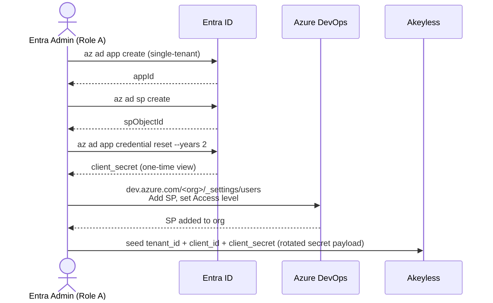

# Runbook: Azure DevOps Service Principal Access Token Rotation

> **Rotator:** `azuredevops_sp_token` (Azure DevOps) in this repo. See the [main README](../README.md#azuredevops_sp_token) for where this runbook fits.
> **Scope:** Entra ID app registration with a client secret, granting the service principal access to one Azure DevOps organization, and Akeyless Rotated Secret wiring. Covers AAD access-token rotation end to end.
> **Status:** Verified end to end against the custom-producer rotator.
> **Estimated time:** ~5 minutes for initial bootstrap; ~1 minute to rotate the App's client secret.
> **Prerequisites:** Global Administrator (or Application Administrator + Cloud Application Administrator) on the Entra tenant; *Project Collection Administrator* (or equivalent) on the target Azure DevOps organization to add a service principal as a member; `az` CLI signed in to the right tenant. No `kubectl exec` into the rotator pod. No interactive sign-in by a delegated user.

> **Choosing a method.** The custom-producer also ships a `pat` rotator that mints long-lived Azure DevOps Personal Access Tokens via OAuth refresh-token. That rotator is interactive (requires a one-time delegated user sign-in via the bootstrap helper) and has a separate runbook. Use this SP runbook when consumers can refresh credentials hourly and you want a fully non-interactive setup. Use [`azuredevops-pat.md`](azuredevops-pat.md) when consumers expect a long-lived ADO PAT or need to authenticate against the PATs Lifecycle API.

---

## What this runbook solves

You have an automation system (a CI runner, a deploy worker, a script that calls the Azure DevOps REST API) that needs **short-lived Azure DevOps credentials it can mint on demand without any human in the loop**. The obvious design (service principal → ADO PAT) does not work, because Microsoft has explicitly blocked it.

> Microsoft Learn, *Manage PATs with REST API*:
> *"Service principals or managed identities can't create or manage PATs. Only delegated user tokens are supported."*

What service principals **can** do is exchange `client_credentials` for an Azure AD access token scoped to the Azure DevOps resource. That access token authenticates against:

- The **Azure DevOps REST API** at `https://dev.azure.com/{org}/_apis/` for the full set of work-items, pipelines, artifacts, identity, etc. operations.
- **Git over HTTPS** to ADO repos when the token is used as the `oauth2` password (basic-auth username `oauth2`, password is the AAD token).

It cannot authenticate against the PATs Lifecycle API; that one requires a delegated user token regardless of what the consumer is doing.

This runbook covers the four-step setup so the rotator can mint and roll AAD access tokens on a schedule, and the consumer can read the current token from Akeyless on demand.

---

## Failure mode you are avoiding

The first instinct for non-interactive ADO automation is "create a static SP, paste its client_secret into config, let it run." That works, but the secret has a 1-2 year expiry depending on policy, and renewal is a manual ticket ("our pipeline broke, the SP secret expired"). The lazier alternative is generating an `az account get-access-token` 1-hour token and pasting it directly into a config; see the corresponding *Failure mode* section in [`azuredevops-pat.md`](azuredevops-pat.md#failure-mode-you-are-avoiding) for what that looks like at 02:00.

This rotator removes both: the long-lived secret stays in Akeyless rather than the consumer's config, and the AAD token is regenerated as often as the consumer needs.

A second silent-failure mode specific to this method: the SP is registered in Entra and `client_credentials` exchanges return tokens, but the SP has not been granted access in the target Azure DevOps organization. ADO returns HTTP 203 with the literal `<!DOCTYPE html ... Azure DevOps Services | Sign In`. The token is "valid" from Entra's perspective but ADO does not recognise the principal. *Step 2* exists to prevent this.

---

## Architecture

### Setup flow (runs once)



### Rotation flow (runs every cycle)

```mermaid
sequenceDiagram
    participant Rotator as Rotator
    participant Store as Akeyless
    participant Entra as Entra ID

    Rotator->>Store: read tenant_id, client_id, client_secret
    Store-->>Rotator: payload
    Rotator->>Entra: POST /oauth2/v2.0/token<br/>grant_type=client_credentials<br/>scope=499b84ac-.../.default
    Entra-->>Rotator: access_token, expires_in (~3599s)
    Rotator->>Store: persist access_token + expires_at
    Note over Rotator,Store: no refresh_token, no PAT-API call.<br/>Previous AAD tokens are not actively revoked;<br/>they auto-expire within ~1h.
```

The rotation is one HTTP round-trip and zero state besides the new token. There is no equivalent to the PAT method's create-before-revoke sequencing because AAD access tokens cannot be invalidated individually.

### Components

| Component | Role | Where it lives |
|---|---|---|
| **Entra app registration** | Single-tenant app with a client secret. The SP attached to it is what authenticates. One per automation chain (or shared if the same scope works for multiple consumers). | Your Entra tenant |
| **Service principal** | The SP attached to the Entra app. ADO recognises it by its `originId` (the SP's `id` in Microsoft Graph). | Your Entra tenant |
| **Client secret** | The `client_credentials` long-lived input. Default Microsoft policy caps at 24 months; rotate every 12-18 months to stay ahead of expiry. | Akeyless rotated secret payload, plus Entra (visible expiry, hidden value after first display) |
| **ADO organization membership** | A user-shaped record in `dev.azure.com/<org>/_settings/users` that maps the SP's Entra `originId` to an access level (Stakeholder / Basic / Visual Studio / etc.). Without it, every API call returns HTTP 203 with HTML. | The target ADO organization |
| **`azuredevops_sp_token` rotator** | Code in `go/rotator/internal/targets/azuredevops/sp_target.go` that performs the `client_credentials` exchange and writes the token back. | This repo, packaged in the rotator container image |
| **Akeyless Web Target** | Akeyless object pointing at the rotator's `/sync/rotate` URL. Shared across all rotated secrets the unified container handles. | Akeyless Console / API |
| **Akeyless Rotated Secret** | Akeyless object holding `tenant_id`, `client_id`, `client_secret`, and the rotator-managed `token` and `expires_at`. | Akeyless Console / API |

### Key constants

| Constant | Value | What it is |
|---|---|---|
| **Azure DevOps resource ID** | `499b84ac-1321-427f-aa17-267ca6975798` | Microsoft's well-known app ID for Azure DevOps. Use as the resource (`.default` scope) when requesting tokens for ADO. Identical in every Entra tenant. |
| **`.default` scope** | `499b84ac-1321-427f-aa17-267ca6975798/.default` | The application-level scope used by `client_credentials`. |
| **Azure AD token endpoint** | `https://login.microsoftonline.com/{tenant}/oauth2/v2.0/token` | Where `client_credentials` exchanges happen. |
| **ADO REST API base** | `https://dev.azure.com/{org}/_apis/` | What consumers call with the minted token. |

### Timers

| Timer | Lives in | Value | What it controls |
|---|---|---|---|
| **AAD access-token TTL** | Entra | ~3600s (`expires_in` in the response, set by Entra, not configurable) | How long the minted `eyJ...` token is valid. After expiry it returns 401 against ADO. |
| **Client secret expiry** | Entra | configured at `credential reset --years N` (default 24 months) | After this, all `client_credentials` exchanges fail with `AADSTS7000222`. Rotate the secret out of band and rebase the payload. |
| **Rotation interval** | Akeyless rotated secret | `--rotation-interval`, days, Akeyless minimum 1 | How often the rotator mints a fresh AAD access token. |

The minted token always lasts ~1h. With `--rotation-interval 1` (one day), the token will already be expired between scheduled rotations. Either accept that and have consumers handle 401 by triggering rotation themselves, or trigger rotation just-in-time before each consumer call.

---

## Prerequisites

- You know the **Entra tenant ID** (the one whose users own the target Azure DevOps organization).
- You know the **ADO organization name** (the `{org}` segment in `https://dev.azure.com/{org}`).
- You have **Project Collection Administrator** rights (or Owner) on that ADO organization. Adding a service principal as a member of the organization requires this; without it, the SP can authenticate to Entra but cannot call the ADO REST API.
- `az` CLI 2.40+ signed in to the tenant.

---

## Roles and responsibilities

| Role | Who / what permissions | Steps they perform |
|---|---|---|
| **A. Entra tenant admin** | Global Administrator, **or** Application Administrator + Cloud Application Administrator on the tenant. Can register apps, reset client secrets, and grant admin consent. | 1a, 1b, 1c, 1d, 1e; Decommission steps D2 to D4 |
| **B. ADO Project Collection Administrator** | Owner of the target ADO organization, or holder of *Project Collection Administrator* group membership. Can add users (including service principals) to `_settings/users`. May be the same person as Role A. | 2a only |
| **C. Automation operator / Akeyless admin** | Whoever owns the Akeyless account and the rotator deployment. Needs admin access in Akeyless and write access to the rotator's Kubernetes namespace. Needs no Azure permissions beyond access to the `client_secret` Role A produced. | 3, 4, Verification, ongoing operations |

There is no equivalent to the PAT runbook's "delegated user" role. Nobody signs in interactively in this method.

### Quick permission check (Role A)

```bash
az login --tenant <tenant-id>
az rest --method GET --uri "https://graph.microsoft.com/v1.0/me/memberOf" \
  --query "value[?'@odata.type'=='#microsoft.graph.directoryRole'].displayName" -o tsv
```

A line reading `Global Administrator`, `Application Administrator`, or `Cloud Application Administrator` means you can do Step 1.

### Verify `az` context

```bash
az account show --query '{user:user.name, tenantId:tenantId, subscriptionId:id}' -o json
```

Confirm `tenantId` matches the tenant you intend to use.

---

## Step 1: Register the Entra app and add a client secret

> **👤 Performed by: Role A (Entra tenant admin)**
> **Required permissions:** Global Administrator, **or** Application Administrator + Cloud Application Administrator.
> **If this isn't you:** copy the commands below to your tenant admin and ask them to send back the **App ID**, the **client secret**, and the tenant ID.

### 1a. Create the app *(Role A)*

```bash
APP=$(az ad app create \
  --display-name "ado-sp-token-rotator" \
  --sign-in-audience AzureADMyOrg \
  --query '{appId:appId, objectId:id}' -o json)

echo "$APP"
# => {"appId": "xxxxxxxx-...", "objectId": "yyyyyyyy-..."}

APP_ID=$(echo "$APP" | python3 -c "import json,sys;print(json.load(sys.stdin)['appId'])")
```

Notes:
- `--sign-in-audience AzureADMyOrg`: single-tenant. Multi-tenant (`AzureADMultipleOrgs`) is rare for ADO automation and complicates secret management.
- We do **not** pass `--is-fallback-public-client true` here. This app is a confidential client (it has a client secret); public-client mode is only for device-code flow, which is the PAT method.
- We do **not** pass `--required-resource-accesses`. The `client_credentials` flow with `.default` scope works without an explicit delegated-permission grant.

### 1b. Create the service principal *(Role A)*

```bash
az ad sp create --id "$APP_ID" --query '{spObjectId:id}' -o json
# => {"spObjectId": "zzzzzzzz-..."}
```

Capture the `spObjectId`. You may need it later for ADO membership lookups.

### 1c. Add a client secret *(Role A)*

```bash
RESET=$(az ad app credential reset \
  --id "$APP_ID" \
  --display-name "akeyless-sp-token-rotator" \
  --years 2 \
  --query '{clientId:appId, clientSecret:password}' -o json)

echo "$RESET"
# capture clientSecret immediately; Azure does not show it again
```

> **`az ad app credential reset` clears all existing passwords on the App by default.** A freshly-created app has no credentials, so this is harmless. If you are reusing an existing app that already has password credentials, pass `--append` to keep them: `az ad app credential reset --id $APP_ID --display-name akeyless-sp-token-rotator --years 2 --append --query '{clientId:appId, clientSecret:password}' -o json`.

The expiry of the new credential is visible separately:

```bash
az ad app credential list --id "$APP_ID" \
  --query "[?displayName=='akeyless-sp-token-rotator'].{name:displayName, endDate:endDateTime}" -o table
```

> **Newly-created secrets occasionally take 30 to 60 seconds to propagate across Entra.** If your first `client_credentials` exchange (Step 3) returns `AADSTS7000215: Invalid client secret`, wait a minute and retry; it usually clears on its own.

### 1d. Capture and verify *(Role A)*

```bash
echo "tenant_id:     $(az account show --query tenantId -o tsv)"
echo "client_id:     $APP_ID"
echo "client_secret: <capture from 1c>"
```

These three values are what you will paste into the Akeyless rotated-secret payload in Step 4. Treat the secret as a password-equivalent until it is in your secret store.

### 1e. *(Optional)* Lock down the App's permission surface

Out of the box the SP has whatever access ADO grants based on its membership (Step 2). If you want to ensure the SP cannot call non-ADO Microsoft Graph endpoints, leave `requiredResourceAccess` empty (the default after `app create`). Verify:

```bash
az ad app show --id "$APP_ID" --query '{
  displayName:displayName,
  appId:appId,
  signInAudience:signInAudience,
  permissions:requiredResourceAccess
}' -o json
```

`permissions` should be `[]` for a minimal SP.

---

## Step 2: Add the service principal to the Azure DevOps organization

> **👤 Performed by: Role B (ADO Project Collection Administrator)**
> **Required permissions:** Owner of the target ADO organization, or *Project Collection Administrator* membership.
> **If this isn't you:** the Entra-side SP is already created; you only need to send the SP's **display name** (`ado-sp-token-rotator`) to your ADO admin and ask them to perform 2a. They send back nothing; you can then move on to Step 3.

### 2a. Add the SP via the ADO organization users page *(Role B)*

The User Entitlements REST API rejects service principals with `"The Principal Name is usually an email address"` unless invoked with very specific shape constraints, and `az devops` extension does not have a first-class "add SP" command at this time. **The portal path is the documented and reliable route.**

1. Navigate to `https://dev.azure.com/<your-org>/_settings/users` in a browser signed in as a Project Collection Administrator.
2. Click **Add users**.
3. In the *Users or Service Principals* field, type the App's display name (`ado-sp-token-rotator`). The SP appears with a "Service Principal" badge.
4. Set **Access level** to **Basic** for full REST access. Choose **Stakeholder** if you only need work-items read/write and want to avoid a Basic license seat.
5. Optionally restrict to specific projects under *Add to projects*; otherwise leave blank to grant org-wide access.
6. Click **Add**.

### 2b. Verify the SP can call ADO

Skip ahead to [Step 3: Smoke-test the credentials](#step-3-smoke-test-the-credentials) and run the `_apis/projects` probe at the end. HTTP 200 confirms membership took effect. HTTP 203 with HTML means the SP is in Entra but not in ADO; recheck Step 2a.

---

## Step 3: Smoke-test the credentials

> **👤 Performed by: Role C (automation operator)**
> **Required permissions:** access to the three values from Step 1d. No Azure permissions beyond holding the secret.

Before wiring Akeyless, prove the triple actually works against ADO. This catches mismatched IDs, missing org membership, and the propagation delay before they show up as Akeyless rotation failures.

### 3a. Mint a token by hand *(Role C)*

```bash
TENANT_ID=<your-tenant-id>
CLIENT_ID=<from Step 1>
CLIENT_SECRET=<from Step 1c>
ADO_ORG=<your-org>

RESP=$(curl -sS -X POST "https://login.microsoftonline.com/${TENANT_ID}/oauth2/v2.0/token" \
  -H "Content-Type: application/x-www-form-urlencoded" \
  --data-urlencode "grant_type=client_credentials" \
  --data-urlencode "client_id=${CLIENT_ID}" \
  --data-urlencode "client_secret=${CLIENT_SECRET}" \
  --data-urlencode "scope=499b84ac-1321-427f-aa17-267ca6975798/.default")

echo "$RESP" | jq 'if .access_token then {ok:true, expires_in} else {ok:false, err:.error, msg:.error_description} end'
# expected: {"ok":true, "expires_in":3599}

ACCESS_TOKEN=$(echo "$RESP" | jq -r .access_token)
```

If the response is `AADSTS7000215`, the secret is wrong, or the secret was created less than 60 seconds ago and Entra has not yet propagated it. Wait and retry.

### 3b. Confirm the token authenticates against ADO *(Role C)*

```bash
curl -sS -o /dev/null -w "ADO REST projects: HTTP %{http_code}\n" \
  -H "Authorization: Bearer $ACCESS_TOKEN" \
  "https://dev.azure.com/${ADO_ORG}/_apis/projects?api-version=7.1-preview.4"
# expected: HTTP 200

curl -sS -o /dev/null -w "ADO REST connectionData: HTTP %{http_code}\n" \
  -H "Authorization: Bearer $ACCESS_TOKEN" \
  "https://dev.azure.com/${ADO_ORG}/_apis/connectionData?api-version=7.1-preview.1"
# expected: HTTP 200
```

If either call returns 203 with an HTML body, Step 2 was not completed correctly. Go back and add the SP to the ADO organization.

If both return 200, the credentials are good. Proceed to Step 4.

### 3c. *(Optional)* Confirm the PATs API rejects the token *(Role C)*

This is only useful if you want to confirm the Microsoft restriction is in effect:

```bash
curl -sS -o /dev/null -w "PATs API: HTTP %{http_code}\n" \
  -H "Authorization: Bearer $ACCESS_TOKEN" \
  "https://vssps.dev.azure.com/${ADO_ORG}/_apis/tokens/pats?api-version=7.1-preview.1"
# expected: HTTP 401 or 203 with HTML
```

The PATs Lifecycle API requires a delegated user token; that is what the [PAT runbook](azuredevops-pat.md) covers. SP tokens cannot use it.

---

## Step 4: Wire the credentials into an Akeyless rotated secret

> **👤 Performed by: Role C (automation operator)**
> **Required permissions:** Akeyless admin (create/update Web Targets and Rotated Secrets), and `kubectl` access to the rotator's namespace if you need to fix `AKEYLESS_ACCESS_ID`.

### 4a. Select an Akeyless admin profile *(Role C)*

```bash
~/code/akeyless/akeyless configure --profile admin \
  --access-id "<your-access-id>" \
  --access-type access_key \
  --access-key "<your-access-key>" \
  --gateway-url "<your-gateway-url>"
```

The rest of this runbook calls the CLI with `--token=admin` to use this profile.

### 4b. Match the rotator's expected access ID to your gateway *(Role C)*

The rotator pod validates every inbound `AkeylessCreds` JWT against the access ID in its `AKEYLESS_ACCESS_ID` env var. If that does not match the access ID your gateway uses, every rotation fails with `unauthorized access for access id ...`. To fix:

```bash
GW_NS=infra-security              # adjust to your gateway's namespace
GW_ACCESS_ID=$(kubectl -n "$GW_NS" get secret akeyless-gateway-conf-secret \
  -o jsonpath='{.data.gateway-access-id}' | base64 -d)

kubectl -n rotator set env deployment/custom-producer \
  AKEYLESS_ACCESS_ID="$GW_ACCESS_ID"
kubectl -n rotator rollout status deployment/custom-producer
```

If you already configured this for the PAT method or any other rotator on the same deployment, skip.

### 4c. Create the Web Target *(Role C)*

The Akeyless gateway calls the Web Target URL **verbatim**. For rotation, the URL must point at `/sync/rotate`.

```bash
ROTATOR_BASE_URL="http://custom-producer.rotator.svc.cluster.local:8080"   # adjust per topology

~/code/akeyless/akeyless target create web --token=admin \
  --name "/Targets/custom-producer" \
  --url "${ROTATOR_BASE_URL}/sync/rotate"
# expected: A new target named /Targets/custom-producer was successfully created
```

Skip if this Web Target already exists from another rotator.

### 4d. Create the Rotated Secret *(Role C)*

```bash
~/code/akeyless/akeyless create-rotated-secret --token=admin \
  --name "/Rotated/azure-devops-sp-token" \
  --target-name "/Targets/custom-producer" \
  --rotator-type custom \
  --auto-rotate true \
  --rotation-interval 1 \
  --custom-payload "{
    \"type\": \"azuredevops_sp_token\",
    \"tenant_id\": \"${TENANT_ID}\",
    \"client_id\": \"${CLIENT_ID}\",
    \"client_secret\": \"${CLIENT_SECRET}\",
    \"organization\": \"${ADO_ORG}\"
  }"
# expected: A new rotated secret named /Rotated/azure-devops-sp-token was successfully created
```

Notes on flags:

- `--rotator-type custom`: required for any custom-producer-backed rotated secret.
- `--rotation-interval 1`: one day, the Akeyless minimum. AAD access tokens auto-expire in ~1h regardless. Either accept the gap and have consumers handle 401 by triggering rotation themselves, or trigger rotation just-in-time before each consumer call.
- `--auto-rotate true`: schedules background rotation. Set to `false` if every consumer call rotates just-in-time.
- `organization` field: documentation only. The rotator does not use it; consumers use it to know which `dev.azure.com/{org}` host to call.

### 4e. Trigger first rotation and verify *(Role C)*

```bash
~/code/akeyless/akeyless rotate-secret --token=admin --name "/Rotated/azure-devops-sp-token"
# expected: ... was successfully rotated
```

If you see `AADSTS7000215` here and the secret was created within the last 60 seconds, that is the propagation delay. Akeyless retries automatically; check the rotated value once `rotate-secret` returns success. If it does not return success after a minute, retry the command.

```bash
TOKEN=$(~/code/akeyless/akeyless get-rotated-secret-value --token=admin \
  --name "/Rotated/azure-devops-sp-token" \
  | jq -r '.value.payload | fromjson | .token')

echo "${TOKEN:0:20}..."
# expected: a JWT starting with eyJ

curl -sS -o /dev/null -w "ADO REST via rotated token: HTTP %{http_code}\n" \
  -H "Authorization: Bearer $TOKEN" \
  "https://dev.azure.com/${ADO_ORG}/_apis/projects?api-version=7.1-preview.4"
# expected: HTTP 200
```

If both checks pass, rotation works end to end.

### 4f. Ongoing operations *(Role C)*

```bash
AK="~/code/akeyless/akeyless --token=admin"
SECRET=/Rotated/azure-devops-sp-token

# Manual rotation (smoke test or just-in-time mint for a sensitive job)
$AK rotate-secret --name "$SECRET"

# Read the current AAD access token (consumer workflow)
$AK get-rotated-secret-value --name "$SECRET" | jq -r '.value.payload | fromjson | .token'

# Status / last error
$AK describe-item --name "$SECRET" | jq '{rotator_status, last_rotation_error}'

# Rebase the payload after rotating the App's client secret
NEW_SECRET=$(az ad app credential reset --id "$CLIENT_ID" --years 2 --append \
  --query password -o tsv)
$AK update-rotated-secret-val --name "$SECRET" \
  --new-custom-payload "{
    \"type\": \"azuredevops_sp_token\",
    \"tenant_id\": \"${TENANT_ID}\",
    \"client_id\": \"${CLIENT_ID}\",
    \"client_secret\": \"${NEW_SECRET}\",
    \"organization\": \"${ADO_ORG}\"
  }"
$AK rotate-secret --name "$SECRET"
```

```bash
# Tail rotator logs while triggering
kubectl -n <rotator-namespace> logs deploy/custom-producer --tail=50
# expected on success:
#   dispatching request endpoint=rotate type=azuredevops_sp_token
#   minted Azure DevOps SP access token tenant_id=... client_id=... expires_in=3599
```

---

## Client-secret lifecycle

| Event | Effect on rotation |
|---|---|
| Successful `client_credentials` exchange | New AAD access token returned; `token` and `expires_at` updated. **No refresh-token rolling**, no further state change. |
| Client secret expires (default 24 months from `credential reset`) | All exchanges fail with `AADSTS7000222: Invalid client secret`. Rotate the secret out of band per Step 4f and rebase the payload. |
| Admin rotates the client secret out of band | Same as expiry. Use the same rebase path. |
| SP is removed from the ADO organization | Token mint succeeds, but every API call returns 203 + HTML sign-in page. Re-add per Step 2a. |
| App registration is deleted | All client secrets invalidated. Re-create the App + SP per Step 1. |

**Monitoring recommendation:** alarm on `rotator_status: RotationFailed` for `/Rotated/azure-devops-sp-token`. Also track the SP's secret expiry date (returned by `az ad app credential list` as `endDateTime`); alarm at 30 days remaining.

### How to rotate the App's signing secret

1. Step 1c again, with `--append` so existing credentials remain valid during cutover.
2. Update the Akeyless payload with the new secret (Step 4f, `update-rotated-secret-val`).
3. Trigger rotation (Step 4e) and confirm a JWT comes back.
4. Once the rotation has succeeded, delete the old credential from the App settings page (Azure portal → App registrations → your app → *Certificates & secrets* → delete) or via `az ad app credential delete --id $APP_ID --key-id <old-key-id>`.

No consumer downtime; existing in-flight AAD access tokens still work until expiry.

---

## Verification checklist

> **👤 Performed by: Role C**

After Step 4e, confirm:

```bash
SECRET=/Rotated/azure-devops-sp-token
AK="~/code/akeyless/akeyless --token=admin"
ADO_ORG=<your-org>

# 1. Akeyless says rotation is healthy
$AK describe-item --name "$SECRET" \
  | jq '{rotator_status, last_rotation_error}'
# expected: {"rotator_status":"RotationSucceeded","last_rotation_error":null}

# 2. The minted token is a JWT
TOKEN=$($AK get-rotated-secret-value --name "$SECRET" | jq -r '.value.payload | fromjson | .token')
[ "${TOKEN:0:3}" = "eyJ" ] && echo "✅ token shape OK" || echo "❌ token shape wrong"

# 3. The minted token works against ADO REST
curl -sS -o /dev/null -w "ADO REST: HTTP %{http_code}\n" \
  -H "Authorization: Bearer $TOKEN" \
  "https://dev.azure.com/${ADO_ORG}/_apis/projects?api-version=7.1-preview.4"
# expected: HTTP 200

# 4. A second rotation produces a different token
OLD="$TOKEN"
$AK rotate-secret --name "$SECRET" >/dev/null
NEW=$($AK get-rotated-secret-value --name "$SECRET" | jq -r '.value.payload | fromjson | .token')
[ "$OLD" != "$NEW" ] && echo "✅ token rolls" || echo "❌ token did not change"
curl -sS -o /dev/null -w "NEW ADO REST: HTTP %{http_code}\n" \
  -H "Authorization: Bearer $NEW" \
  "https://dev.azure.com/${ADO_ORG}/_apis/projects?api-version=7.1-preview.4"
# expected: HTTP 200
```

All four passing means: Entra accepts the client secret, the SP is in the ADO org, the rotator reaches Entra, and tokens roll cleanly between rotations.

---

## Troubleshooting

### `AADSTS7000215: Invalid client secret provided`

The `client_secret` on the rotated-secret payload no longer matches the App registration. The most common causes:

- The SP's secret was rotated out of band; the payload still has the old value. Run `az ad app credential reset --id $CLIENT_ID --years 2 --append --query password -o tsv` and use Step 4f to rebase.
- The credential reset itself was less than ~60 seconds ago and Entra has not finished propagating the new secret. Wait and retry.
- The wrong `client_id` was supplied; the secret is for a different App. Confirm with `az ad app show --id $CLIENT_ID --query '{displayName, appId}' -o json`.

### `AADSTS7000222: The provided client secret keys for app '...' are expired`

The credential's `endDateTime` has passed. Generate a fresh secret with `az ad app credential reset` and rebase the payload via Step 4f.

### `client_credentials` exchange returns 200 but ADO returns HTTP 203 with `<!DOCTYPE html ... Sign In ...`

The SP authenticated successfully against Entra, but the Azure DevOps organization does not recognise it. Add the SP to the org per Step 2a. Until that is done, every consumer call (and every rotation verification call) fails with the HTML sign-in page.

### `client_credentials` exchange returns 200 but every ADO REST call returns 401 even after Step 2

The SP was added to the org but with **no access level** (Stakeholder, Basic, etc.). Reopen `https://dev.azure.com/<org>/_settings/users`, find the SP, and assign Basic.

Alternatively, the rotator is using a different `client_id` than the one you added in Step 2a. Verify:

```bash
$AK get-rotated-secret-value --name "$SECRET" \
  | jq -r '.value.payload | fromjson | .client_id'
```

The output must match the `appId` shown in your ADO users page.

### Rotator log: `tenant_id is required` or `client_id is required` or `client_secret is required`

The payload is missing one of the three required fields. Inspect:

```bash
$AK get-rotated-secret-value --name "$SECRET" \
  | jq -r '.value.payload | fromjson | {tenant_id, client_id, has_secret: (.client_secret|length>0)}'
```

Use Step 4f to rebase with a complete payload.

### Akeyless: `creds rotation failed: unexpected response code 404: 404 page not found`

The Web Target URL is wrong. The gateway calls it verbatim, and the rotator only mounts handlers at `/sync/{create,revoke,rotate}` and `/health`. Confirm the URL is `<base>/sync/rotate`:

```bash
$AK get-target-details --name "/Targets/custom-producer" \
  | jq '.value.web_target_details.url'
```

Fix with `target update web --name ... --url <correct-url>`.

### Akeyless: `creds rotation failed: unexpected response code 401: {"error":"invalid credentials"}`

The rotator pod's `AKEYLESS_ACCESS_ID` does not match the gateway's. See Step 4b.

### Akeyless: `creds rotation failed: rotate request failed: ... no such host`

DNS from the gateway to the Web Target URL is failing. The gateway and rotator are likely in different clusters or different networks with no DNS bridge. Use a Service exposed via NodePort/LoadBalancer/Ingress reachable from the gateway and update the Web Target URL.

### Akeyless: rotation works manually but silently fails on schedule

Likely causes:

- Gateway pod restarted recently and is still warming caches; trigger one manual rotation post-restart.
- Gateway memory pressure; check `kubectl top pod`.
- Rotated Secret's `timeout-sec` is too tight; bump to 30s+. The `client_credentials` exchange typically completes in <2s, so timeout pressure usually means a network problem rather than rotator slowness.

---

## Decommissioning

> **👤 Performed by: Role A (Entra tenant admin) + Role B (ADO admin) + Role C (automation operator)**

To fully disable the automation's ability to mint tokens for this SP:

**Step D1: scale down the rotator OR stop using this rotated secret *(Role C)***

Scale the rotator deployment to zero only if no other rotated secret depends on it. Otherwise leave it running and proceed to D2.

```bash
# Optional, only when this is the last rotated secret on the deployment
kubectl -n rotator scale deployment/custom-producer --replicas=0
```

**Step D2: delete the Akeyless Rotated Secret *(Role C)***

```bash
$AK delete-item --name "/Rotated/azure-devops-sp-token"
# expected: Item /Rotated/... was successfully deleted
```

This drops the stored payload, including the App's client secret.

**Step D3: delete the Akeyless Web Target *(Role C, only if no other rotated secret uses it)***

```bash
$AK delete-target --name "/Targets/custom-producer"
```

Skip if other rotated secrets share the target.

**Step D4: remove the SP from the ADO organization *(Role B)***

In `https://dev.azure.com/<org>/_settings/users`, find the SP and click **Delete user**. The SP can no longer call ADO REST endpoints. Its client_credentials still mints tokens against `499b84ac-.../.default`, but those tokens won't authenticate against ADO.

**Step D5: delete the client secret(s) on the App *(Role A)***

```bash
# List active credentials
az ad app credential list --id "$APP_ID" \
  --query '[].{name:displayName, keyId:keyId, endDate:endDateTime}' -o table

# Delete each by keyId
az ad app credential delete --id "$APP_ID" --key-id <key-id>
```

This invalidates the secret immediately, so any leftover payload in another secret store cannot be used.

**Step D6: delete the service principal *(Role A)***

```bash
SP_OBJ_ID=$(az ad sp show --id "$APP_ID" --query id -o tsv)
az ad sp delete --id "$SP_OBJ_ID"
```

**Step D7: delete the App registration *(Role A)***

```bash
az ad app delete --id "$APP_ID"
```

Once D7 completes, no future `client_credentials` exchange will succeed against this `client_id`.

**Verification *(Role C)***

```bash
$AK describe-item --name "/Rotated/azure-devops-sp-token"
# expected: Item not found
```

In Entra, the App registration should 404 in the portal within a few minutes of D7.

---

## Reference values

All values below are tenant-agnostic and safe to hardcode.

| Name | Value |
|---|---|
| Azure DevOps resource ID | `499b84ac-1321-427f-aa17-267ca6975798` |
| `.default` scope | `499b84ac-1321-427f-aa17-267ca6975798/.default` |
| Azure AD token endpoint | `https://login.microsoftonline.com/{tenant}/oauth2/v2.0/token` |
| ADO REST API base | `https://dev.azure.com/{org}/_apis/` |
| Global admin Entra role ID | `62e90394-69f5-4237-9190-012177145e10` |
| Application Administrator role ID | `9b895d92-2cd3-44c7-9d02-a6ac2d5ea5c3` |
| Cloud Application Administrator role ID | `158c047a-c907-4556-b7ef-446551a6b5f7` |
| Default client-secret lifetime (`--years 2`) | 24 months from `credential reset` |
| Default minted-token lifetime | ~3600 seconds (`expires_in` in the response) |

---

## Related

- Microsoft Learn: [OAuth 2.0 client credentials grant flow](https://learn.microsoft.com/en-us/entra/identity-platform/v2-oauth2-client-creds-grant-flow)
- Microsoft Learn: [Service principals in Azure DevOps](https://learn.microsoft.com/en-us/azure/devops/integrate/get-started/authentication/service-principal-managed-identity)
- Microsoft Learn: [Client secrets reference](https://learn.microsoft.com/en-us/entra/identity-platform/security-tokens)
- This repo: `go/rotator/internal/targets/azuredevops/sp_target.go` for the implementation.
- Sibling runbook: [`azuredevops-pat.md`](azuredevops-pat.md), the same shape applied to ADO PAT minting via OAuth refresh-token.
