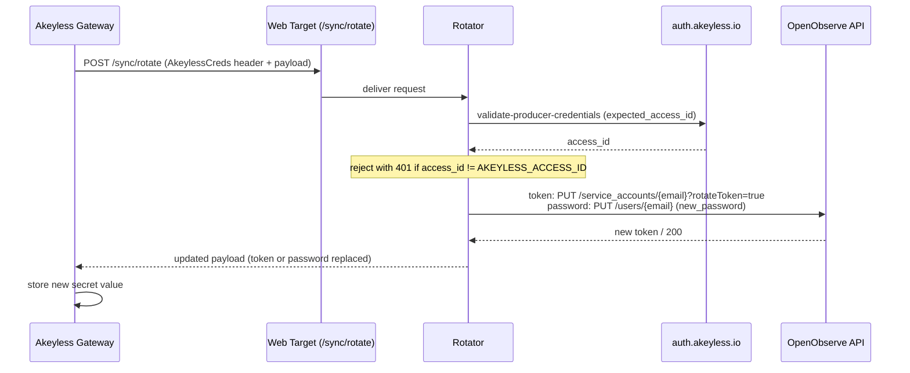
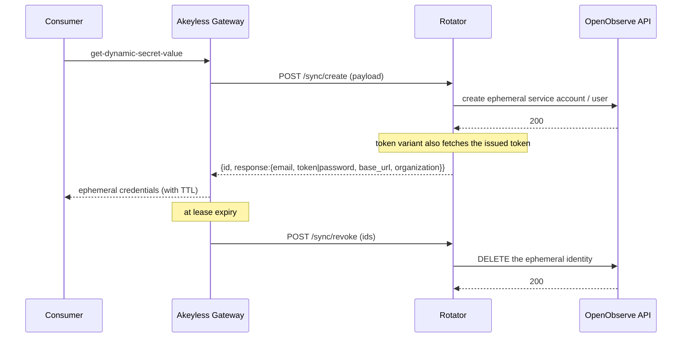

# Runbook: OpenObserve Credential Rotation via Custom Producer

> **Rotator:** `openobserve_token` and `openobserve_password` in this repo. See the [main README](../README.md#supported-targets) for where this runbook fits.
> **Scope:** OpenObserve service-account token and user-password rotation, wired into Akeyless Rotated Secrets (in-place) and Dynamic Secrets (ephemeral). Covers both credential types end to end.
> **Status:** Verified against OpenObserve v0.40 and the custom-producer rotator.
> **Estimated time:** ~10 minutes per credential, given an existing rotator deployment and a reachable Akeyless gateway.
> **Prerequisites:** OpenObserve administrator credentials (the root user, or an `admin`-role user); an Akeyless gateway that can reach the rotator in-cluster; an Akeyless access ID with `admin` on `/Targets/*`, `/3-Rotated_Secrets/*`, and `/4-Dynamic_Secrets/*`; write access to the Kubernetes namespace running the rotator.

> **Choosing a credential type.**
> - `openobserve_token` rotates an OpenObserve **service-account token**. Service accounts authenticate to the OpenObserve REST API with HTTP Basic auth (`email:token`). They cannot sign in to the web UI. Use this for programmatic API access: ingestion clients, dashboards-as-code, scripts.
> - `openobserve_password` rotates a real OpenObserve **user password**. Users sign in to the web UI at `/web/login` and authenticate to the API. Use this when a person or tool needs interactive console access.
>
> **Choosing a secret model.**
> - A **Rotated Secret** rotates one fixed credential in place on a schedule. The identity (service account or user) is stable; only its secret changes. Stored under `/3-Rotated_Secrets/`.
> - A **Dynamic Secret** provisions a fresh, uniquely named identity per lease and deletes it when the lease expires. Stored under `/4-Dynamic_Secrets/`.

---

## What this runbook solves

OpenObserve ships no native Akeyless rotator. The custom-producer adds two:

- `openobserve_token` rotates service-account tokens for API access.
- `openobserve_password` rotates user passwords for web UI login.

Each integrates with Akeyless as either a Rotated Secret (in-place rotation of a fixed identity) or a Dynamic Secret (ephemeral identity per lease). The rotator holds the OpenObserve admin credentials in its own environment and writes only the rotated credential into the secret payload.

---

## Failure mode you are avoiding

**Admin credentials in the payload.** A custom rotator payload is round-tripped: the rotator output becomes the next rotation input, and any consumer that can read the secret value reads the entire payload. Placing the OpenObserve admin username and password in the payload exposes them to every consumer of the rotated credential. This rotator reads admin credentials from its environment (`OPENOBSERVE_ADMIN_USERNAME` / `OPENOBSERVE_ADMIN_PASSWORD`) and never writes them to the payload.

**Service-account token used for UI login.** OpenObserve service accounts are API-only. A service-account token presented at `/web/login` returns `Invalid credentials`. For interactive console access, rotate a user password with `openobserve_password`, not a service-account token.

---

## Architecture

### Rotation flow (Rotated Secret)



### Lease flow (Dynamic Secret)



### Components

| Component | Role | Where it lives |
|---|---|---|
| **OpenObserve admin credentials** | Root user or an `admin`-role user. The rotator authenticates to the OpenObserve management API with these. | Kubernetes secret on the rotator deployment |
| **Custom-producer rotator** | Implements `/sync/create`, `/sync/revoke`, `/sync/rotate`; dispatches by the payload `type` field. | Rotator namespace |
| **Web Target** | The URL the gateway calls when a Rotated Secret fires. One Web Target serves every rotated secret of any type. | Akeyless account |
| **Rotated Secret** | In-place rotation of a fixed identity on a schedule. | Akeyless `/3-Rotated_Secrets/` |
| **Dynamic Secret** | Ephemeral identity provisioned per lease, deleted on expiry. | Akeyless `/4-Dynamic_Secrets/` |
| **Target service account** | The identity whose token an `openobserve_token` Rotated Secret rotates. | OpenObserve |
| **Target user** | The identity whose password an `openobserve_password` Rotated Secret rotates. | OpenObserve |

### Key constants

| Name | Value | What it is |
|---|---|---|
| Rotator sync endpoints | `POST {rotator}/sync/{create,revoke,rotate}` | Fixed by the custom-producer. The Web Target and dynamic-secret sync URLs target these paths. |
| Rotator health | `GET {rotator}/health` | Liveness check, returns `{"status":"healthy"}`. |
| Admin authentication | HTTP Basic (`admin-email:password`) | How the rotator authenticates to the OpenObserve API. |
| SA token rotate | `PUT /api/{org}/service_accounts/{email}?rotateToken=true` | Mints a new token and invalidates the previous one in one call. |
| SA create / get / delete | `POST /api/{org}/service_accounts`, `GET .../{email}`, `DELETE .../{email}` | Service-account lifecycle. Create does not return the token; fetch it with GET. |
| User create | `POST /api/{org}/users` (`email,password,first_name,last_name,role`) | Provisions a UI-login user. |
| User set password | `PUT /api/{org}/users/{email}` (`new_password,first_name,last_name,role`) | Replaces a user password. |
| User delete | `DELETE /api/{org}/users/{email}` | Removes a user. |
| UI login check | `POST /auth/login` (`{"name":"...","password":"..."}`) | Returns `{"status":true}` on success, `401` otherwise. |
| Built-in user role | `admin` | The only role accepted when custom (enterprise RBAC) roles are disabled. `member`/`user`/`viewer` return `400 Custom roles not allowed`. |

---

## Prerequisites

- The custom-producer rotator is deployed and reachable by your Akeyless gateway at an in-cluster URL of the form `http://<rotator-svc>.<rotator-ns>.svc.cluster.local:8080` (example: `custom-producer.rotator.svc.cluster.local`). See [Deploying to Kubernetes](../README.md#deploying-to-kubernetes).
- You know the OpenObserve **base URL** the rotator should call. Use the in-cluster service URL so the rotator reaches OpenObserve without leaving the cluster, for example `http://openobserve-openobserve-standalone.observability.svc:5080`. The OpenObserve API listens on plain HTTP on this port; TLS is terminated at the ingress.
- You know the OpenObserve **organization** identifier (default installs use `default`).
- You have OpenObserve admin credentials (the root user email and password, or an `admin`-role user).
- The `akeyless` CLI is available and authenticated. All commands below assume the binary is on `PATH` as `akeyless`; substitute the full path if not.

---

## Roles and responsibilities

| Role | Who / what permissions | Steps they perform |
|---|---|---|
| **A. OpenObserve administrator** | Holds the root user or an `admin`-role user. Can create users and service accounts. | Supplies admin credentials for Step 1; provisions the target identity in Step 4 (Rotated Secrets only). |
| **B. Akeyless / rotator operator** | Akeyless access ID with `admin` on `/Targets/*`, `/3-Rotated_Secrets/*`, `/4-Dynamic_Secrets/*`; write access to the rotator's Kubernetes namespace. | Steps 1, 2, 3, 5, 6; verification; ongoing operations. |

### Select an Akeyless admin profile (Role B)

The default CLI profile is often read-only. Use an admin profile for every create, rotate, and delete command below.

```bash
ls ~/.akeyless/profiles/
grep access_id ~/.akeyless/profiles/admin.toml
# expected: access_id = 'p-xxxxxxxxxxxxxx'
```

All commands below use `--profile admin`. Adjust if your admin profile is named differently.

---

## Step 1: Provision admin credentials into the rotator

> **Performed by: Role B, using credentials from Role A**
> **Required permissions:** write access to the rotator's Kubernetes namespace.

The rotator reads `OPENOBSERVE_ADMIN_USERNAME` and `OPENOBSERVE_ADMIN_PASSWORD` from its environment. They are never carried in the secret payload. Store them in a Kubernetes secret and reference that secret from the deployment.

```bash
ROTATOR_NS=rotator

kubectl -n "$ROTATOR_NS" create secret generic openobserve-rotator-admin \
  --from-literal=OPENOBSERVE_ADMIN_USERNAME="<admin-email>" \
  --from-literal=OPENOBSERVE_ADMIN_PASSWORD="<admin-password>" \
  --dry-run=client -o yaml | kubectl apply -f -

kubectl -n "$ROTATOR_NS" set env deployment/custom-producer \
  --from=secret/openobserve-rotator-admin

kubectl -n "$ROTATOR_NS" rollout status deployment/custom-producer --timeout=120s
```

Confirm the variables are present in the running pod without printing their values:

```bash
kubectl -n "$ROTATOR_NS" exec deploy/custom-producer -- \
  sh -c 'env | grep -oE "OPENOBSERVE_ADMIN_(USERNAME|PASSWORD)" | sort'
# expected:
#   OPENOBSERVE_ADMIN_PASSWORD
#   OPENOBSERVE_ADMIN_USERNAME
```

> A single admin credential serves every OpenObserve rotated and dynamic secret handled by this rotator. Re-run this step only to change the admin account or its password.

---

## Step 2: Match the rotator's expected access ID to the gateway's access ID

> **Performed by: Role B**
> **Required permissions:** read access to the gateway secret; write access to the rotator deployment.

The rotator validates the `AkeylessCreds` header on every incoming request against its `AKEYLESS_ACCESS_ID` environment variable, via `auth.akeyless.io/validate-producer-credentials`. If the variable does not match the access ID the gateway uses to sign outbound webhook calls, every rotation fails with HTTP 401 and the Akeyless error reads:

```
creds rotation failed: unexpected response code 401: {"error":"invalid credentials"}
```

Read the gateway access ID and patch the rotator to match.

```bash
GATEWAY_NS=infra-security
ROTATOR_NS=rotator

GATEWAY_ACCESS_ID=$(kubectl -n "$GATEWAY_NS" \
  get secret akeyless-gateway-conf-secret \
  -o jsonpath='{.data.gateway-access-id}' | base64 -d)
echo "$GATEWAY_ACCESS_ID"
# expected: p-xxxxxxxxxxxxxx

kubectl -n "$ROTATOR_NS" set env deployment/custom-producer \
  AKEYLESS_ACCESS_ID="$GATEWAY_ACCESS_ID"

kubectl -n "$ROTATOR_NS" rollout status deployment/custom-producer --timeout=120s
```

---

## Step 3: Create the Web Target

> **Performed by: Role B**

A Rotated Secret calls a Web Target. A Dynamic Secret does not; it references the rotator sync URLs directly (Step 6). Create the Web Target once; it serves every rotated secret regardless of `type`.

```bash
TARGET_NAME="/Targets/OpenObserve-Target"
ROTATOR_URL="http://custom-producer.rotator.svc.cluster.local:8080/sync/rotate"

akeyless target create web \
  --name "$TARGET_NAME" \
  --url "$ROTATOR_URL" \
  --description "OpenObserve rotator endpoint" \
  --profile admin
```

The URL must be resolvable by the gateway pod. The path `/sync/rotate` is fixed by the rotator. If the rotator later moves namespaces or services, update the URL:

```bash
akeyless target update web --name "$TARGET_NAME" --url "<new-url>" --profile admin
```

---

## Step 4: Provision the target identity

> **Performed by: Role A (OpenObserve administrator)**

Rotated Secrets rotate an existing identity in place, so that identity must exist first. Dynamic Secrets create their own identities per lease; skip this step for them.

Set common values for the calls below. `O2` is the externally reachable base URL (the in-cluster URL is used by the rotator; an administrator running these calls by hand uses whatever URL they can reach).

```bash
O2="https://o2.example.local"
ORG="default"
ADMIN="<admin-email>:<admin-password>"
```

### 4a. Service account (for an `openobserve_token` Rotated Secret)

```bash
SA_EMAIL="akeyless-rotated@example.local"

curl -sS -u "$ADMIN" -X POST "$O2/api/$ORG/service_accounts" \
  -H "Content-Type: application/json" \
  -d "{\"email\":\"$SA_EMAIL\",\"organization\":\"$ORG\",\"first_name\":\"akeyless\",\"last_name\":\"service-account\"}"
# expected: {"code":200,"message":"User saved successfully"}
```

### 4b. User (for an `openobserve_password` Rotated Secret)

The role must be `admin` unless your install has enterprise custom roles enabled. Set any initial password; the first rotation replaces it.

```bash
USER_EMAIL="akeyless-ui@example.local"

curl -sS -u "$ADMIN" -X POST "$O2/api/$ORG/users" \
  -H "Content-Type: application/json" \
  -d "{\"email\":\"$USER_EMAIL\",\"password\":\"Seed-Initial-1!\",\"first_name\":\"akeyless\",\"last_name\":\"ui\",\"role\":\"admin\"}"
# expected: {"code":200,"message":"User saved successfully"}
```

---

## Step 5: Create the Rotated Secret

> **Performed by: Role B**

The payload carries only routing fields and the rotated credential. No admin credentials. The rotator fills `token` / `password` on first rotation.

Commands that create, update, or rotate a secret on a gateway require `--gateway-url` pointing at the gateway Configuration Management port (`8000`). If that port is not directly reachable from where you run the CLI, port-forward it first:

```bash
kubectl -n infra-security port-forward svc/akeyless-gateway 18000:8000 &
GW=http://localhost:18000
```

The custom-rotator rotation interval is expressed in **minutes**: `--rotation-interval 1440` is daily.

### 5a. Token (API access)

```bash
O2_URL="http://openobserve-openobserve-standalone.observability.svc:5080"
SA_EMAIL="akeyless-rotated@example.local"

PAYLOAD=$(cat <<JSON
{"type":"openobserve_token","base_url":"$O2_URL","organization":"default","email":"$SA_EMAIL"}
JSON
)

akeyless create-rotated-secret \
  --name "/3-Rotated_Secrets/openobserve-sa-token" \
  --target-name "/Targets/OpenObserve-Target" \
  --rotator-type custom \
  --auto-rotate true \
  --rotation-interval 1440 \
  --custom-payload "$PAYLOAD" \
  --gateway-url "$GW" \
  --profile admin
```

### 5b. Password (UI login)

```bash
O2_URL="http://openobserve-openobserve-standalone.observability.svc:5080"
USER_EMAIL="akeyless-ui@example.local"

PAYLOAD=$(cat <<JSON
{"type":"openobserve_password","base_url":"$O2_URL","organization":"default","email":"$USER_EMAIL"}
JSON
)

akeyless create-rotated-secret \
  --name "/3-Rotated_Secrets/openobserve-ui-password" \
  --target-name "/Targets/OpenObserve-Target" \
  --rotator-type custom \
  --auto-rotate true \
  --rotation-interval 1440 \
  --custom-payload "$PAYLOAD" \
  --gateway-url "$GW" \
  --profile admin
```

### 5c. Trigger the first rotation and read the value

```bash
NAME="/3-Rotated_Secrets/openobserve-sa-token"   # or .../openobserve-ui-password

akeyless rotate-secret --name "$NAME" --gateway-url "$GW" --profile admin
# expected: "The Rotated Secret named ... was successfully rotated"

# get-rotated-secret-value does NOT take --gateway-url
akeyless get-rotated-secret-value --name "$NAME" --profile admin \
  | python3 -c "import sys,json;print(json.loads(json.load(sys.stdin)['value']['payload']))"
# expected (token):    {'type': 'openobserve_token', ..., 'email': '...', 'token': '...'}
# expected (password): {'type': 'openobserve_password', ..., 'email': '...', 'password': '...'}
```

---

## Step 6: Create the Dynamic Secret

> **Performed by: Role B**

A Dynamic Secret references the rotator sync URLs directly; no Web Target is involved. The `email` field is a **base address**: each lease provisions a unique identity `<local-part>-<timestamp>@<domain>` and deletes it on expiry. `--user-ttl` sets the lease lifetime.

### 6a. Token (ephemeral API service account)

```bash
ROTATOR="http://custom-producer.rotator.svc.cluster.local:8080"
O2_URL="http://openobserve-openobserve-standalone.observability.svc:5080"

PAYLOAD=$(cat <<JSON
{"type":"openobserve_token","base_url":"$O2_URL","organization":"default","email":"akeyless-dyn@example.local"}
JSON
)

akeyless dynamic-secret create custom \
  --name "/4-Dynamic_Secrets/openobserve-sa" \
  --create-sync-url "$ROTATOR/sync/create" \
  --revoke-sync-url "$ROTATOR/sync/revoke" \
  --rotate-sync-url "$ROTATOR/sync/rotate" \
  --payload "$PAYLOAD" \
  --user-ttl 60m \
  --gateway-url "$GW" \
  --profile admin
```

### 6b. Password (ephemeral UI user)

```bash
ROTATOR="http://custom-producer.rotator.svc.cluster.local:8080"
O2_URL="http://openobserve-openobserve-standalone.observability.svc:5080"

PAYLOAD=$(cat <<JSON
{"type":"openobserve_password","base_url":"$O2_URL","organization":"default","email":"akeyless-uidyn@example.local"}
JSON
)

akeyless dynamic-secret create custom \
  --name "/4-Dynamic_Secrets/openobserve-ui-user" \
  --create-sync-url "$ROTATOR/sync/create" \
  --revoke-sync-url "$ROTATOR/sync/revoke" \
  --rotate-sync-url "$ROTATOR/sync/rotate" \
  --payload "$PAYLOAD" \
  --user-ttl 60m \
  --gateway-url "$GW" \
  --profile admin
```

### 6c. Issue and revoke a lease

```bash
NAME="/4-Dynamic_Secrets/openobserve-sa"   # or .../openobserve-ui-user

# Issue a lease (provisions an ephemeral identity). Does NOT take --gateway-url.
akeyless get-dynamic-secret-value --name "$NAME" --profile admin
# expected (token):    {"base_url":"...","email":"akeyless-dyn-<ts>@...","organization":"default","token":"..."}
# expected (password): {"base_url":"...","email":"akeyless-uidyn-<ts>@...","organization":"default","password":"..."}

# List active leases, then revoke one (deletes the ephemeral identity)
LEASE_ID=$(akeyless dynamic-secret tmp-creds get --name "$NAME" --profile admin --json \
  | python3 -c "import sys,json;print(json.load(sys.stdin)[0]['id'])")
akeyless dynamic-secret tmp-creds delete --name "$NAME" --tmp-creds-id "$LEASE_ID" \
  --gateway-url "$GW" --profile admin
```

---

## Verification checklist

> **Performed by: Role B**

Set the externally reachable base URL and organization:

```bash
O2="https://o2.example.local"
ORG="default"
```

**Token credential, API access:**

```bash
EMAIL="<email-from-secret-value>"
TOKEN="<token-from-secret-value>"
curl -sS -o /dev/null -w "API auth: HTTP %{http_code}\n" \
  -u "$EMAIL:$TOKEN" "$O2/api/$ORG/streams"
# expected: HTTP 200
```

**Password credential, UI login:**

```bash
EMAIL="<email-from-secret-value>"
PASSWORD="<password-from-secret-value>"
curl -sS -X POST "$O2/auth/login" \
  -H "Content-Type: application/json" \
  -d "{\"name\":\"$EMAIL\",\"password\":\"$PASSWORD\"}"
# expected: {"status":true,"message":""}
```

A password credential also signs in interactively at `$O2/web/login` with the same email and password.

---

## Troubleshooting

### Rotation fails with HTTP 401 `invalid credentials`

The rotator's `AKEYLESS_ACCESS_ID` does not match the access ID the gateway uses to sign webhook calls. Apply Step 2.

### Rotator logs `OPENOBSERVE_ADMIN_USERNAME and OPENOBSERVE_ADMIN_PASSWORD must be set in the rotator environment`

The admin-credentials secret is not wired into the deployment. Apply Step 1, then confirm the variables are present in the pod.

### Rotation fails with an OpenObserve `401`/`403`

The admin credentials in the rotator environment are wrong or lack permission. Verify them directly: `curl -u "<admin-email>:<admin-password>" $O2/api/$ORG/organizations` must return `200`.

### `get-dynamic-secret-value` fails with `cannot unmarshal string into Go value of type map[string]interface {}`

The rotator returned the create response as a JSON string rather than a JSON object. The current rotator returns an object. If this appears, the deployed image predates that fix; redeploy the current image.

### User create returns `400 Custom roles not allowed`

The `role` is not a built-in role. Use `admin`. Other role names require enterprise custom roles to be enabled in OpenObserve.

### UI login returns `401 Invalid credentials` for a token credential

Service accounts are API-only and cannot sign in to the web UI. For console access, use an `openobserve_password` secret, which rotates a real user's password.

### `dial tcp: lookup <name> ... no such host` during rotation

The Web Target URL (Rotated Secret) or sync URLs (Dynamic Secret) point at a name the gateway pod cannot resolve. Use the in-cluster service DNS name `<svc>.<ns>.svc.cluster.local` and confirm the gateway and rotator share a network. Update a Web Target with `akeyless target update web`.

### `undefined option --gateway-url`

`get-rotated-secret-value` and `get-dynamic-secret-value` do not accept `--gateway-url`. Remove the flag for those commands. The create, rotate, and `tmp-creds delete` commands do require it.

### `failed to validate Gateway URL ... failed to establish connection to gateway`

The `--gateway-url` host is not reachable from where the CLI runs, or the local port is already bound. Port-forward the gateway Configuration Management port to a free local port and pass that, for example `kubectl -n infra-security port-forward svc/akeyless-gateway 18000:8000` with `--gateway-url http://localhost:18000`.

### Status 401 Unauthorized on a create/update command

The CLI profile lacks write permission on the target path. Use an admin profile (`--profile admin`).

---

## Decommissioning

> **Performed by: Role A (OpenObserve administrator) + Role B (Akeyless / rotator operator)**

**Step D1: delete the Akeyless secrets (Role B)**

```bash
akeyless delete-item --name "/3-Rotated_Secrets/openobserve-sa-token"   --profile admin
akeyless delete-item --name "/3-Rotated_Secrets/openobserve-ui-password" --profile admin
akeyless delete-item --name "/4-Dynamic_Secrets/openobserve-sa"          --profile admin
akeyless delete-item --name "/4-Dynamic_Secrets/openobserve-ui-user"     --profile admin
```

Deleting a Dynamic Secret revokes its active leases, which deletes the ephemeral identities. Confirm none remain:

```bash
curl -sS -u "$ADMIN" "$O2/api/$ORG/service_accounts" \
  | python3 -c "import sys,json;print([u['email'] for u in json.load(sys.stdin).get('data',[])])"
curl -sS -u "$ADMIN" "$O2/api/$ORG/users" \
  | python3 -c "import sys,json;print([u['email'] for u in json.load(sys.stdin).get('data',[])])"
```

**Step D2: delete the Web Target (Role B)**

```bash
akeyless target delete --name "/Targets/OpenObserve-Target" --profile admin
```

**Step D3: delete the target identities in OpenObserve (Role A)**

```bash
curl -sS -u "$ADMIN" -X DELETE "$O2/api/$ORG/service_accounts/akeyless-rotated@example.local"
curl -sS -u "$ADMIN" -X DELETE "$O2/api/$ORG/users/akeyless-ui@example.local"
```

**Step D4: remove the admin secret if the rotator handles no other OpenObserve secrets (Role B)**

```bash
kubectl -n rotator set env deployment/custom-producer OPENOBSERVE_ADMIN_USERNAME- OPENOBSERVE_ADMIN_PASSWORD-
kubectl -n rotator delete secret openobserve-rotator-admin
```

---

## Reference values

| Name | Value |
|---|---|
| Token rotator type | `openobserve_token` |
| Password rotator type | `openobserve_password` |
| Rotated secrets folder | `/3-Rotated_Secrets/` |
| Dynamic secrets folder | `/4-Dynamic_Secrets/` |
| Rotation endpoint (Web Target URL) | `{rotator}/sync/rotate` |
| Create / revoke endpoints (Dynamic Secret) | `{rotator}/sync/create`, `{rotator}/sync/revoke` |
| OpenObserve admin auth | HTTP Basic (`admin-email:password`) |
| Service-account token rotate | `PUT /api/{org}/service_accounts/{email}?rotateToken=true` |
| User password update | `PUT /api/{org}/users/{email}` (field `new_password`) |
| UI login endpoint | `POST /auth/login` (`{"name":"...","password":"..."}`) |
| Built-in user role | `admin` |
| Custom rotation interval unit | minutes (`--rotation-interval 1440` = daily) |

---

## Related

- OpenObserve documentation: <https://openobserve.ai/docs/>
- Main README: [Supported Targets](../README.md#supported-targets), [Configuring Akeyless](../README.md#configuring-akeyless), [Adding a New Target](../README.md#adding-a-new-target)
- Rotator source: `go/rotator/internal/targets/openobserve/`
